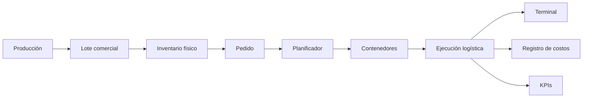
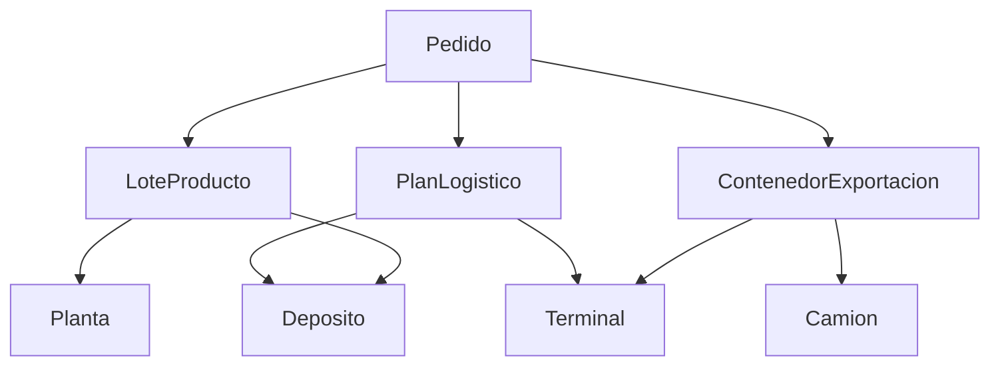

# Arquitectura general

[← Volver al índice](../README.md)

## 1. Propósito

Definir la arquitectura funcional y técnica del modelo de simulación de exportación. El sistema debe representar desde la producción hasta el ingreso del contenedor cargado en terminal.

## 2. Principio rector

```text
Planificar ≠ Ejecutar ≠ Costear
```

- **Planificación:** genera y compara alternativas.
- **Ejecución:** reproduce movimientos, recursos, colas y tiempos mediante DES.
- **Costeo:** registra costos incurridos y evita duplicaciones.

## 3. Vista de contexto



## 4. Capas

### 4.1 Datos maestros

Contiene capacidades, tarifas, compatibilidades, terminales, navieras, tiempos y parámetros de operación.

### 4.2 Dominio comercial

Contiene:

- pedido;
- cliente;
- calidad;
- lote comercial;
- producto;
- incoterm;
- naviera.

### 4.3 Inventario físico

Representa cantidades del mismo lote en planta, depósitos y contenedores.

### 4.4 Planificación

Genera alternativas de:

- consolidación en planta;
- consolidación en depósito;
- cross docking en depósito;
- cross docking en terminal.

### 4.5 Ejecución DES

Administra:

- camiones;
- contenedores;
- posiciones de consolidación;
- posiciones cross dock;
- colas;
- viajes;
- tiempos de espera;
- terminal.

### 4.6 Costeo

Registra costos históricos, incrementales y end-to-end por pedido, lote, contenedor y estrategia.

### 4.7 Analítica

Consolida indicadores de producción, inventario, servicio, capacidad, costo y utilización.

## 5. Componentes principales

| Componente | Función | Estado |
|---|---|---|
| `Main` | Coordinación global | Implementado, sobredimensionado |
| `Planta` | Producción y stock | Implementado |
| `Deposito` | Recepción, almacenamiento y operación | Parcial |
| `Terminal` | Vacíos, ingreso cargado y servicios | Parcial |
| `Pedido` | Demanda de exportación | Implementado y ampliado |
| `LoteProducto` | Identidad y saldo del lote | En transición |
| `Camion` | Transporte de producto o contenedor | Parcial |
| `Envio` | Ejecución agregada anterior | Legado |
| `ContenedorExportacion` | Unidad física de exportación | Creado |
| `PlanLogistico` | Alternativa evaluable | Creado |

## 6. Arquitectura actual versus objetivo

### Actual

```text
Producción diaria
    ↓
Nuevo lote diario
    ↓
Transferencia completa
    ↓
Una ubicación única
    ↓
Reserva agregada
    ↓
Envío
```

### Objetivo

```text
Lote comercial abierto
    ↓
Producción acumulativa
    ↓
Saldos en múltiples ubicaciones
    ↓
Reserva parcial por ubicación
    ↓
N contenedores independientes
    ↓
Ejecución y costos por contenedor
```

## 7. Restricción de AnyLogic PLE

PLE admite **10 tipos de agente por modelo** y el modelo ya usa los 10. Ese es el límite exacto que impidió crear el agente `ExistenciaLote`.

Solución definitiva (ADR-030): la existencia física es una **clase Java** dentro del modelo, no un tipo de agente. No consume el cupo de tipos ni el de agentes dinámicos, y es lo apropiado para una estructura que sólo guarda datos.

```java
class Capa {
    Agent  ubicacion;
    double diaIngreso;
    double toneladas;
    double toneladasReservadas;
}
```

Un `LoteProducto` mantiene `List<Capa> capas`. Ver [Inventario del modelo](../03_Logica/Inventario_del_Modelo.md) §2 para el resto de los límites verificados.

## 8. Límites de responsabilidad

### Main debe

- coordinar;
- crear entidades;
- ejecutar planificación;
- consolidar KPIs.

### Main no debería

- administrar directamente cada saldo físico;
- calcular todos los costos locales;
- ejecutar toda la lógica de recursos;
- concentrar todas las reglas de negocio.

### Agentes locales deben

- validar su propia capacidad;
- modificar sus stocks;
- registrar sus costos;
- controlar sus recursos;
- informar disponibilidad.

## 9. Dependencias críticas



## 10. Criterio de selección inicial

```text
Seleccionar la alternativa factible con menor costo incremental,
sujeta al cumplimiento de la fecha límite.
```

En fases posteriores podrán incorporarse ponderaciones de riesgo, capacidad, congestión y nivel de servicio.
