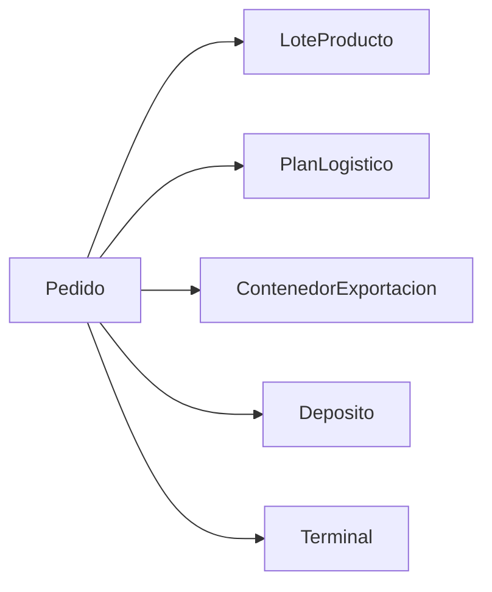
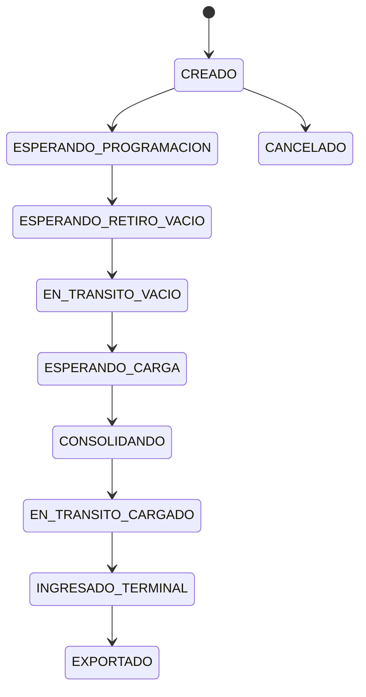

# Catálogo de agentes

[← Volver al índice](../README.md)

## 1. Main

### Rol

Agente raíz y coordinador del modelo.

### Responsabilidades actuales

- contener poblaciones;
- crear lotes, pedidos, planes y contenedores;
- ejecutar asignaciones;
- iniciar transferencias;
- calcular parte de los costos;
- consolidar indicadores.

### Problema arquitectónico

Concentra demasiadas responsabilidades. Debe evolucionar hacia un orquestador, delegando operación física y validación a los agentes locales.

### Poblaciones conocidas

| Población | Tipo | Uso |
|---|---|---|
| `pedidos` | Pedido | Demanda de exportación |
| `lotes` | LoteProducto | Lotes físicos/comerciales actuales |
| `camiones` | Camion | Recursos de transporte |
| `envios` | Envio | Ejecución heredada |
| `planesLogisticos` | PlanLogistico | Alternativas evaluadas |
| `contenedoresExportacion` | ContenedorExportacion | Unidades exportables |

## 2. Planta

### Rol

Origen productivo y ubicación de stock inicial.

### Responsabilidades

- generar producción diaria;
- controlar capacidad;
- registrar excedente;
- almacenar y retirar producto;
- alimentar lotes;
- consolidar contenedores.

### Estado

Implementada para producción y stock. Pendiente consolidación DES completa.

### Variables principales

| Variable | Tipo | Unidad | Descripción |
|---|---|---|---|
| `getStock(producto)` | double | tn | Stock actual, derivado de las capas de la planta (ADR-023) |
| `capacidadJugo` | double | tn | Capacidad máxima |
| `capacidadCascara` | double | tn | Capacidad máxima |
| `capacidadAceite` | double | tn | Capacidad máxima |
| `produccionDiaria*` | double | tn/día | Producción por producto |
| `produccionAcumulada*` | double | tn | Producción generada |
| `excedente*` | double | tn | Producción no almacenada |
| `nivelActivacion*` | double | tn | Umbral de transferencia |
| `stockObjetivo*` | double | tn | Saldo objetivo tras transferencia |

## 3. Deposito

### Rol

Ubicación externa de almacenamiento, consolidación o cross docking.

### Responsabilidades

- validar compatibilidad por producto;
- controlar capacidad;
- recibir producto;
- reservar y liberar stock;
- aplicar IN, almacenamiento y OUT;
- consolidar;
- operar cross docking;
- administrar posiciones y colas.

### Regla simplificada de habilitación

```text
capacidad del producto > 0
```

### Variables objetivo

| Grupo | Variables |
|---|---|
| Capacidad | capacidad por producto |
| Inventario | stock, reservado y libre por producto |
| Costos | IN, almacenamiento diario, OUT |
| Recursos | posiciones consolidación y cross dock |
| Tiempos | descarga, carga, cross dock |
| Indicadores | ocupación, esperas, utilización |

## 4. Terminal

### Rol

Nodo portuario que entrega vacíos y recibe contenedores cargados.

### Terminales iniciales

- Zárate.
- T4.

### Responsabilidades objetivo

- entregar vacío;
- administrar disponibilidad de contenedores;
- recibir cargado;
- operar cross docking o consolidación terminal;
- aplicar costo terminal y THC;
- registrar ingreso y cierre operativo.

## 5. Pedido

### Rol

Demanda comercial de exportación.

### Datos mínimos

- código;
- cliente;
- producto;
- calidad;
- lote solicitado;
- toneladas;
- terminal;
- naviera;
- incoterm;
- día de llegada;
- día límite.

### Relaciones



### Estados esperados

- PENDIENTE;
- ATRASADO;
- RESERVADO;
- PLANIFICADO;
- EN_EJECUCION;
- COMPLETADO;
- CANCELADO.

## 6. LoteProducto

### Rol actual

Combina identidad comercial y ubicación física.

### Rol objetivo

Representar la identidad comercial del lote, mientras mantiene temporalmente saldos físicos por ubicación mediante listas paralelas.

### Reglas

- puede producirse varios días;
- puede despacharse antes de completarse;
- puede dividirse físicamente;
- conserva una sola identidad;
- sus toneladas deben reconciliarse.

### Identidad objetivo

- producto;
- cliente;
- calidad;
- número de lote;
- toneladas objetivo;
- fecha de apertura;
- fecha de cierre;
- estado comercial.

### Saldos objetivo

- producido acumulado;
- reservado total;
- despachado total;
- disponible total;
- pendiente de producir.

## 7. Camion

### Roles diferenciados

#### Camión de producto

Transporta producto a granel o embalado entre planta, depósito y punto de cross docking.

#### Portacontenedor

Retira el vacío, espera carga y devuelve el contenedor cargado.

### Estados objetivo

- DISPONIBLE;
- ASIGNADO;
- VIAJANDO_VACIO;
- ESPERANDO;
- CARGANDO;
- VIAJANDO_CARGADO;
- DESCARGANDO;
- FUERA_DE_SERVICIO.

## 8. Envio

### Estado

Entidad heredada.

### Decisión

Mantener mientras se valida `ContenedorExportacion`. No agregar nuevas responsabilidades salvo correcciones indispensables.

## 9. ContenedorExportacion

### Rol

Unidad física y operativa independiente.

### Datos

- identificador;
- pedido;
- lote;
- producto;
- tipo;
- capacidad;
- toneladas asignadas;
- terminal;
- lugar de carga;
- camión;
- estrategia;
- estado;
- tiempos;
- costos.

### Estados



## 10. PlanLogistico

### Rol

Representar una alternativa sin ejecutarla.

### Contenido

- origen del producto;
- lugar de consolidación;
- terminal;
- estrategia;
- factibilidad;
- motivo de rechazo;
- cantidad de contenedores;
- tiempo estimado;
- costos desglosados;
- costo histórico;
- costo incremental;
- costo end-to-end.

### Estados

- BORRADOR;
- FACTIBLE;
- NO_FACTIBLE;
- SELECCIONADO;
- EN_EJECUCION;
- COMPLETADO;
- CANCELADO.

## 11. Matriz de responsabilidades

| Proceso | Main | Planta | Depósito | Terminal | Pedido | Lote | Contenedor | Plan |
|---|---:|---:|---:|---:|---:|---:|---:|---:|
| Producción | Coordina | Ejecuta |  |  |  | Registra |  |  |
| Transferencia | Coordina | Retira | Recibe |  |  | Actualiza saldo |  | Estima |
| Reserva | Coordina | Consulta | Consulta |  | Solicita | Registra | Asocia | Valida |
| Consolidación | Coordina | Ejecuta | Ejecuta | Ejecuta |  | Descuenta | Cambia estado | Estima |
| Transporte | Coordina |  |  |  |  |  | Ejecuta | Estima |
| Costos | Consolida | Registra local | Registra local | Registra local | Acumula | Acumula | Acumula | Estima |
