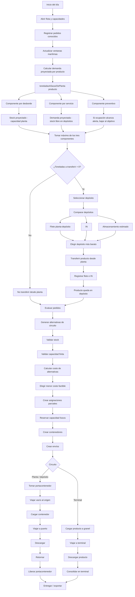
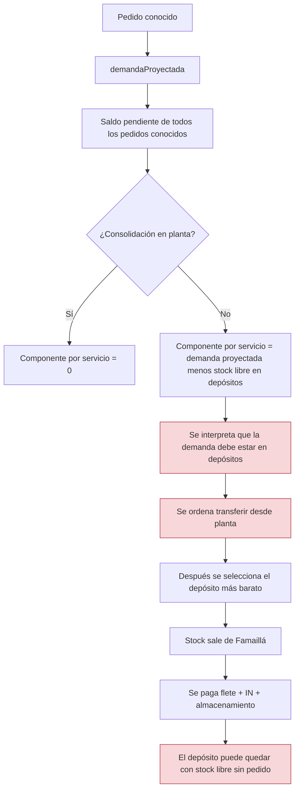
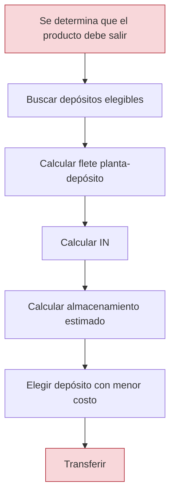
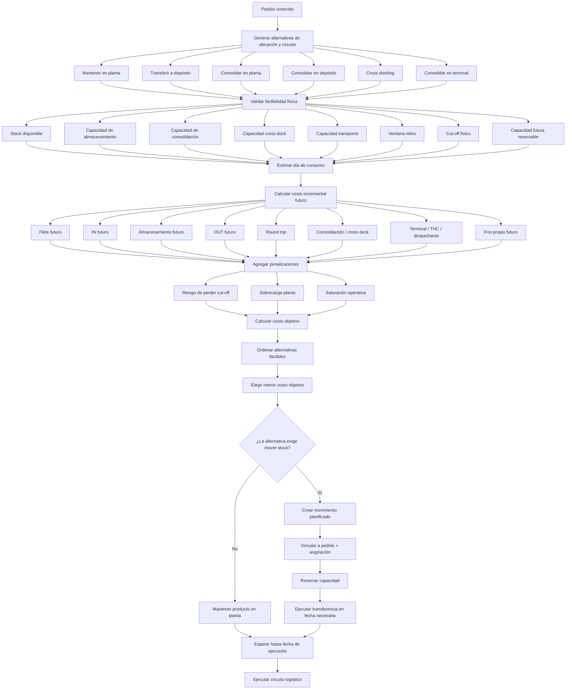
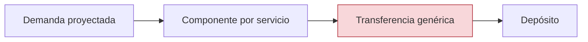
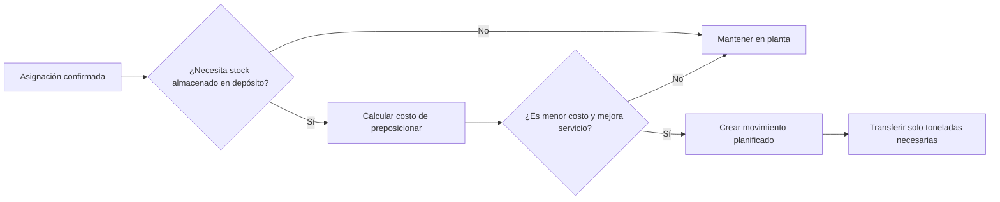
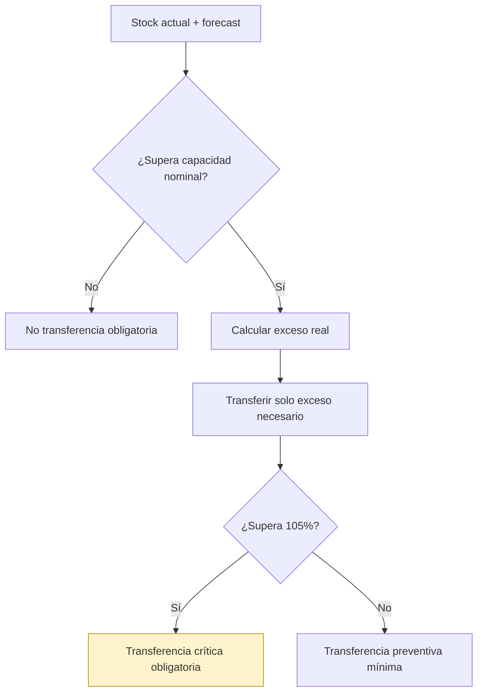
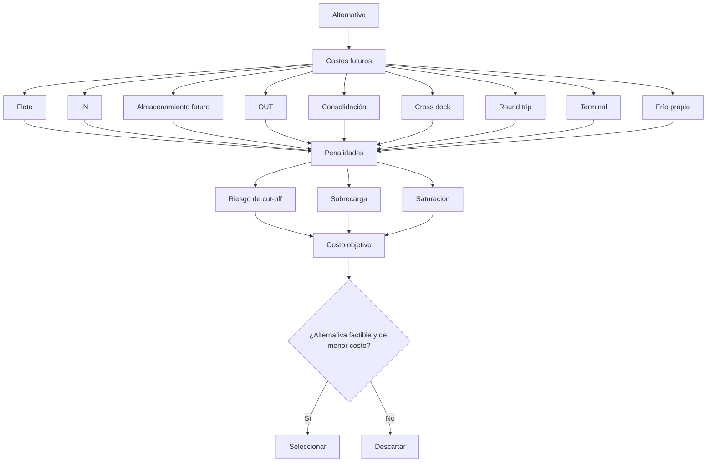
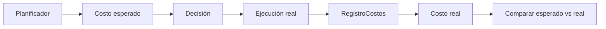
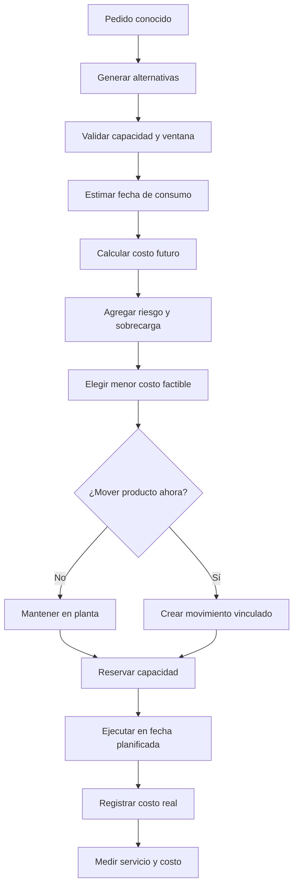

# Flow detallado — Situación actual y cambios propuestos

## Leyenda

- **AZUL**: lógica actual existente.
- **ROJO**: problema detectado.
- **VERDE**: cambio propuesto.
- **NARANJA**: decisión económica nueva.
- **GRIS**: ejecución física ya existente.

---

## 1. Flow general: lógica actual



---

## 2. Problema actual de inventario



### Problema central

La lógica actual compara:

```text
¿A qué depósito conviene enviar?
```

pero no compara antes:

```text
¿Conviene mover o conviene mantener en planta?
```

---

## 3. Flow de decisión económica actual



### Limitación

La alternativa:

```text
MANTENER EN PLANTA
```

no participa en la comparación.

---

## 4. Flow objetivo con planificador económico integral



---

## 5. Cambio clave: transferencia desde planta

### Situación actual



### Nueva situación



---

## 6. Nueva lógica para desborde



### Cambio

El umbral del 85% deja de significar:

```text
vaciar hasta el objetivo
```

y pasa a significar:

```text
activar evaluación anticipada
```

---

## 7. Nueva comparación de costos



---

## 8. Diferencia entre costo esperado y costo real



### Regla

Los costos esperados:

```text
sirven para decidir
```

Los costos reales:

```text
se registran cuando la operación ocurre
```

Nunca registrar el costo esperado como caja.

---

## 9. Cambios a marcar en el código

| Área | Situación actual | Cambio |
|---|---|---|
| `toneladasASacarDePlanta()` | Combina desborde, servicio y prevención | Dividir en transferencia obligatoria y movimientos planificados |
| `componentePorServicio` | Demanda proyectada menos stock en depósitos | Eliminar como transferencia genérica |
| `demandaProyectada()` | Suma saldos pendientes | Mantener solo para forecast y riesgo |
| `seleccionarDeposito()` | Elige depósito luego de decidir mover | Integrar “mantener en planta” en el comparador |
| `AlternativaCircuito` | No modela almacenamiento futuro explícito | Agregar costos futuros y penalidades |
| `PlanLogistico` | Mezcla almacenamiento diario con histórico | Separar histórico vs futuro |
| `revisarTransferenciasPlanta()` | Transfiere antes de que el plan económico lo justifique | Ejecutar solo movimientos obligatorios o planificados |
| Capacidad finita | Ya restringe posiciones | Mantener antes del costo |
| Costos reales | Se devengan en ejecución | Mantener sin cambios |
| Flowcharts | Ejecutan circuitos físicos | Mantener sin rediseño inicial |

---

## 10. Flow final resumido



---

# Criterio rector

```text
No mover por regla.
Mover solo porque:

1. es obligatorio por capacidad;
2. mejora el servicio;
3. reduce el costo incremental esperado;
4. forma parte de un plan confirmado.
```
