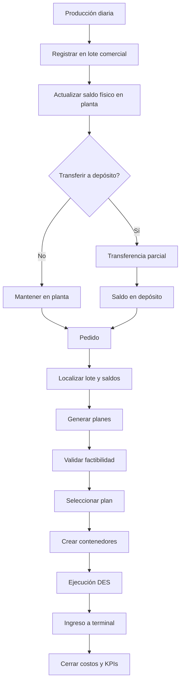
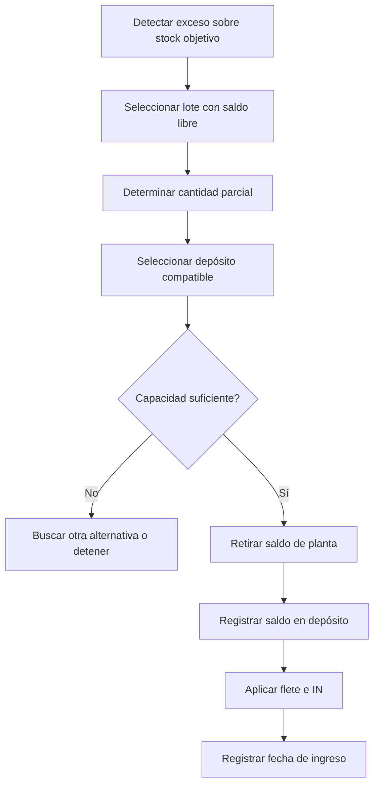
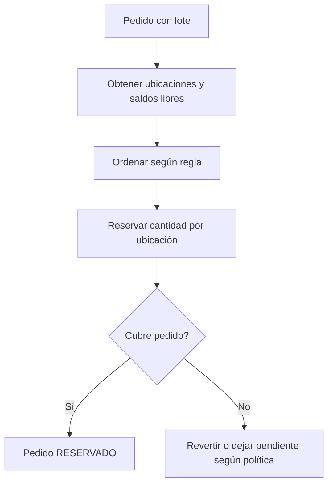
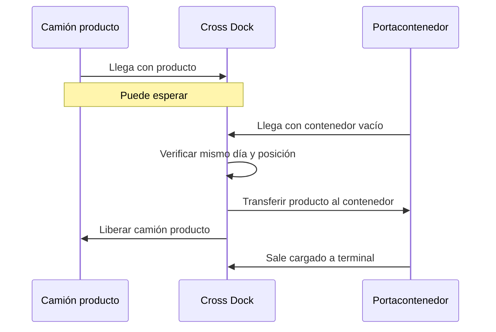
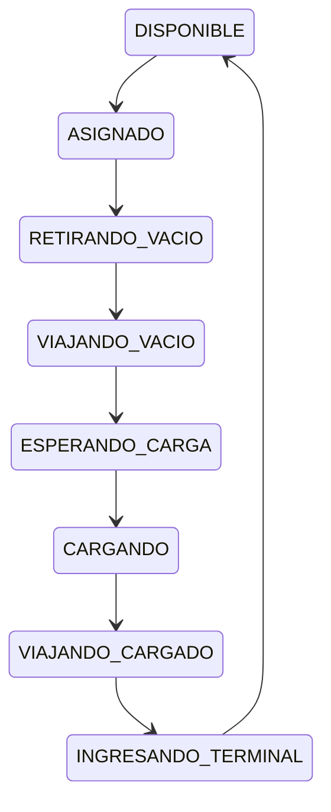

# Flujos operativos

[← Volver al índice](../README.md)

## 1. Flujo end-to-end

## 2. Producción y lote abierto

1. La planta genera producción por producto.
2. `agregarStock()` limita el ingreso por capacidad.
3. Solo la cantidad efectivamente almacenada se registra en el lote.
4. Se localiza el lote comercial abierto por producto, cliente y calidad.
5. Si no existe, se crea.
6. Se incrementa producido acumulado.
7. Se incrementa saldo físico en planta.
8. El lote puede permanecer abierto aunque ya tenga despachos.

## 3. Transferencia planta-depósito

Reglas:

- no cambiar la identidad del lote;
- no mover reservas no autorizadas;
- no permitir saldo negativo;
- mantener parte del lote en planta si corresponde;
- revertir la operación completa ante fallo.

## 4. Recepción de pedido

1. Crear o recibir `Pedido`.
2. Validar campos obligatorios.
3. Confirmar lote específico.
4. Derivar tipo de contenedor.
5. Derivar capacidad.
6. Calcular cantidad de contenedores.
7. Localizar todas las existencias físicas del lote.
8. Generar alternativas.

## 5. Reserva

La política inicial recomendada es reserva atómica: si no puede cubrirse toda la cantidad, se revierte. Una política parcial puede agregarse después.

## 6. Consolidación en planta

1. El pedido tiene saldo reservado en planta.
2. Se crean contenedores.
3. Se asigna portacontenedor.
4. El camión retira vacío en terminal.
5. Viaja a planta.
6. Espera posición de consolidación.
7. Se descuentan toneladas reservadas.
8. Se carga el contenedor.
9. Se aplican consolidación, ciclo, terminal, THC y despachante.
10. El camión regresa cargado.
11. Se registra ingreso terminal.

## 7. Consolidación en depósito

1. El lote está formalmente almacenado.
2. Se aplica almacenamiento histórico hasta el día de salida.
3. Se crea el contenedor.
4. El portacontenedor retira vacío.
5. Viaja al depósito.
6. Se aplica OUT al producto cargado.
7. Se consolida.
8. Regresa a terminal.
9. Se aplican costos portuarios.

## 8. Cross docking

### Recursos requeridos

- camión de producto;
- portacontenedor con vacío;
- posición cross dock.

### Sincronización

### Costos

No aplica:

- IN;
- almacenamiento diario;
- OUT.

Sí aplica:

- flete de producto;
- ciclo contenedor;
- cross docking;
- terminal;
- THC;
- despachante.

## 9. Ciclo del portacontenedor

No se libera el recurso durante la espera de carga.

## 10. Ingreso a terminal

1. El contenedor llega cargado.
2. Solicita recurso o posición de ingreso.
3. Espera si existe cola.
4. Se registra hora de ingreso.
5. Se aplica costo terminal y THC.
6. Se actualiza pedido.
7. Se libera portacontenedor.
8. El contenedor queda `INGRESADO_TERMINAL`.

## 11. Excepciones

- falta de stock;
- falta de capacidad;
- tarifa inexistente;
- contenedor incompatible;
- recurso no disponible;
- pérdida de fecha límite;
- llegada fuera del día de cross docking;
- saldo reservado inconsistente;
- fallo parcial de transferencia.

Cada excepción debe dejar motivo explícito y no producir costos silenciosos.
