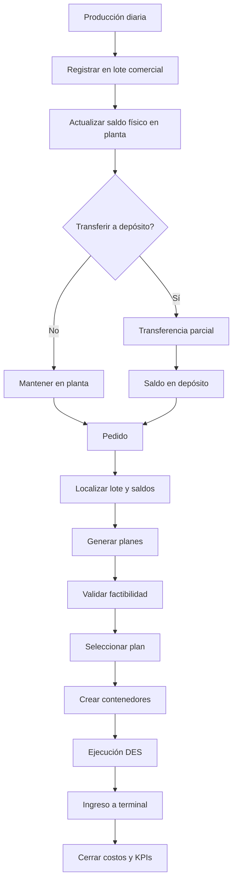
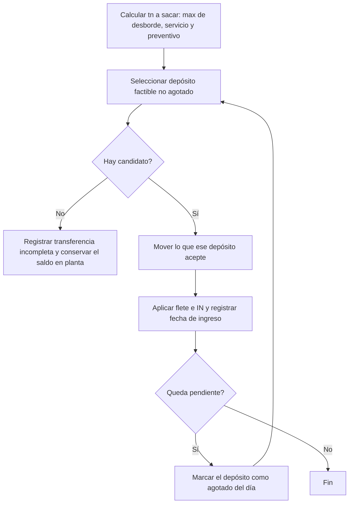
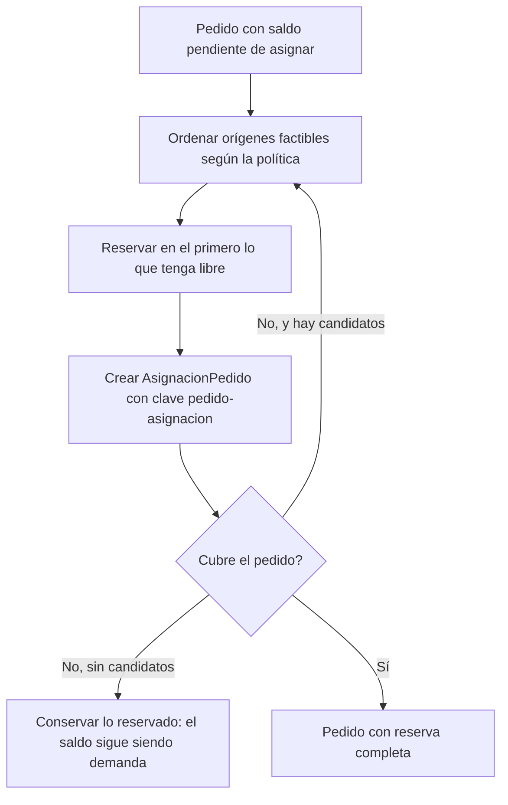
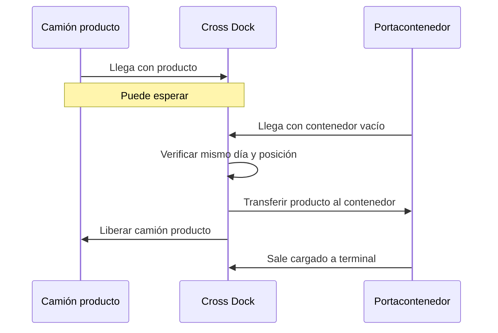
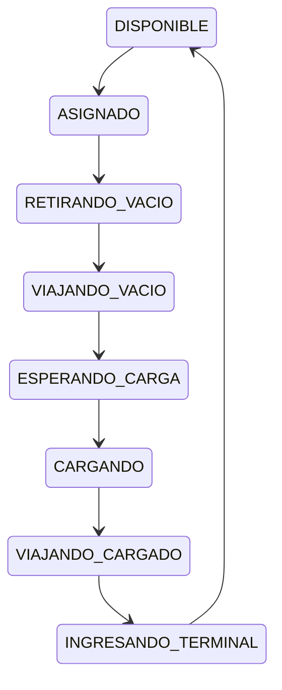

# Flujos operativos

[← Volver al índice](../README.md)

## 1. Flujo end-to-end

## 2. Producción y lote abierto

1. La planta genera producción por producto.
2. `agregarStock()` limita el ingreso por capacidad.
3. Solo la cantidad efectivamente almacenada se registra en el lote.
4. Se localiza el lote comercial abierto por producto, cliente y calidad.
5. Si no existe, se crea.
6. Se incrementa producido acumulado.
7. Se incrementa saldo físico en planta.
8. El lote puede permanecer abierto aunque ya tenga despachos.

## 3. Transferencia planta-depósito

El arranque de la campaña no parte necesariamente de inventario cero: si el escenario trae la hoja `StockInicial`, `cargarStockInicial()` crea los lotes históricos y sus capas antes del primer paso diario, así que el día 0 ya hay producto en planta y en depósitos y los pedidos del día 0 pueden reservarlo (ADR-057). Ese producto entra por la misma puerta que la producción —`inventario.ingresar(...)`— y no devenga ningún costo anterior al día 0.

La cantidad a sacar combina **tres componentes con `max`, no con suma** (ADR-056): desborde sobre la capacidad nominal, servicio (lo que los pedidos van a necesitar desde depósito) y preventivo (bajar del umbral de alerta al objetivo, mirando el forecast de producción). Con política `REACTIVA` el componente preventivo no existe.

El objetivo se **reparte**: una transferencia de 300 tn no se detiene porque en el primer depósito entren 100. El bucle marca ese destino como agotado por hoy y sigue con el siguiente factible hasta cubrir el objetivo, agotar el stock libre o agotar los candidatos. Lo que queda sin mover se cuenta en `transferencias_incompletas`, que es la lectura de falta de espacio en la red.

Cuando la planta está en **sobrecarga crítica** cambia la prioridad del destino —espacio disponible primero, costo como desempate— y **no** el volumen: sumar un cuarto componente sería contar dos veces las mismas toneladas. La producción nunca se bloquea, el producto no se pierde y la penalidad del día se sigue devengando.

Reglas:

- no cambiar la identidad del lote;
- no mover reservas no autorizadas;
- no permitir saldo negativo;
- mantener parte del lote en planta si corresponde;
- revertir la operación completa ante fallo.

## 4. Recepción de pedido

1. Crear o recibir `Pedido`.
2. Validar campos obligatorios.
3. Confirmar lote específico.
4. Derivar tipo de contenedor.
5. Derivar capacidad.
6. Calcular cantidad de contenedores.
7. Localizar todas las existencias físicas del lote.
8. Generar alternativas.

## 5. Reserva

La reserva **no es atómica** (ADR-055): se reserva lo que cada origen pueda dar y se conserva. Un pedido de 500 tn puede quedar cubierto por tres asignaciones de tres sitios distintos, en el mismo día o a lo largo de varios, y cada una tiene su clave de reserva `codigoPedido|idAsignacion`, su circuito y su condición de cross dock. El saldo no cubierto vuelve a competir al día siguiente en lugar de rechazar el pedido.

Las políticas `FIJA_*` conservan su orden de candidatos: lo único que cambia es que aceptan lo que hay en vez de exigir el pedido completo. Las políticas económicas ordenan con el evaluador (ADR-054).

### 5.1 Contenedorización, despacho y entrega

Los contenedores se crean **por asignación y progresivamente**: mientras la reserva viva alcanza para uno completo se arma uno. El último parcial se difiere, porque en el contrato paga como uno lleno, y sólo se arma si el pedido ya está completamente asignado, venció o terminó la campaña.

El despacho consume la reserva **por clave**, así que dos asignaciones del mismo pedido en el mismo sitio no se pisan. La entrega acumula en el pedido y en la asignación; el pedido pasa a `ENTREGADO` sólo cuando el total está cubierto. Si vence con saldo queda `ATRASADO` **conservando** lo entregado, las asignaciones vivas y el origen de cada fracción.

## 6. Consolidación en planta

1. El pedido tiene saldo reservado en planta.
2. Se crean contenedores.
3. Se asigna portacontenedor.
4. El camión retira vacío en terminal.
5. Viaja a planta.
6. Espera posición de consolidación.
7. Se descuentan toneladas reservadas.
8. Se carga el contenedor.
9. Se aplican consolidación, ciclo, terminal, THC y despachante.
10. El camión regresa cargado.
11. Se registra ingreso terminal.

## 7. Consolidación en depósito

1. El lote está formalmente almacenado.
2. Se aplica almacenamiento histórico hasta el día de salida.
3. Se crea el contenedor.
4. El portacontenedor retira vacío.
5. Viaja al depósito.
6. Se aplica OUT al producto cargado.
7. Se consolida.
8. Regresa a terminal.
9. Se aplican costos portuarios.

## 8. Cross docking

### Recursos requeridos

- camión de producto;
- portacontenedor con vacío;
- posición cross dock.

### Sincronización

### Costos

No aplica:

- IN;
- almacenamiento diario;
- OUT.

Sí aplica:

- flete de producto;
- ciclo contenedor;
- cross docking;
- terminal;
- THC;
- despachante.

## 9. Ciclo del portacontenedor

No se libera el recurso durante la espera de carga.

## 10. Ingreso a terminal

1. El contenedor llega cargado.
2. Solicita recurso o posición de ingreso.
3. Espera si existe cola.
4. Se registra hora de ingreso.
5. Se aplica costo terminal y THC.
6. Se actualiza pedido.
7. Se libera portacontenedor.
8. El contenedor queda `INGRESADO_TERMINAL`.

## 11. Excepciones

- falta de stock;
- falta de capacidad;
- tarifa inexistente;
- contenedor incompatible;
- recurso no disponible;
- pérdida de fecha límite;
- llegada fuera del día de cross docking;
- saldo reservado inconsistente;
- fallo parcial de transferencia.

Cada excepción debe dejar motivo explícito y no producir costos silenciosos.
