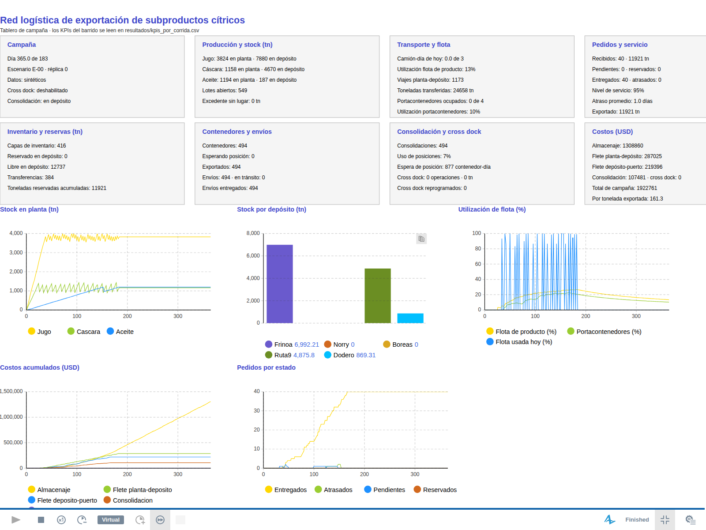
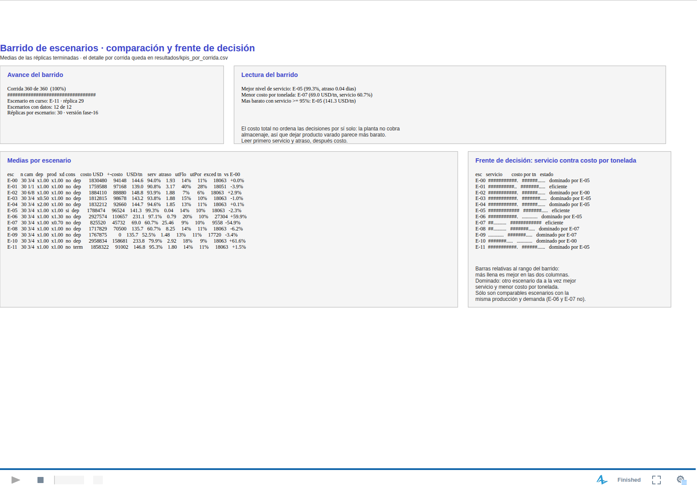

# Tablero e indicadores

Qué muestra la vista de `Main` durante una corrida, cómo se calcula cada número y cómo se lee. Para el paso a paso operativo, ver el [manual de uso](Manual_de_Uso.md).

El tablero es la lectura **de una corrida**. Las decisiones de dimensionamiento se toman sobre el barrido (`resultados/kpis_por_corrida.csv`), donde cada escenario tiene 30 réplicas: un número del tablero es una realización, no un resultado.

---

## 1. Disposición



```
  Campaña        Producción y stock    Transporte y flota   Pedidos y servicio
  Inventario     Contenedores          Consolidación y      Costos
  y reservas     y envíos              cross dock

  [Stock en planta]  [Stock por depósito]  [Utilización de flota]
  [Costos acumulados]  [Estado de los pedidos]
```

Ocho paneles de estado y cinco gráficos de evolución. Debajo del tablero, en el mismo lienzo, están el diagrama de flujo del transporte depósito–terminal y las poblaciones de agentes; se ven alejando el zoom.

---

## 2. Paneles

### Campaña

| Línea | Origen |
|---|---|
| Día actual y horizonte | `time()` y `duracionCampaniaDias` |
| Escenario y réplica | `idEscenario`, `replica` |
| Origen de datos | `origenDatos` |
| Cross dock habilitado | `habilitaCrossDock` |
| Estrategia de consolidación | `estrategiaConsolidacion` |

Es la identidad de la corrida: sin esto, una captura del tablero no se puede reproducir.

### Producción y stock (tn)

Por producto, toneladas **en planta** y **en depósito**, más los lotes comerciales y la sobrecarga de planta.

- Stock: `planta.getStock(producto)` y `stockTotalDepositos(producto)`, ambos derivados de las capas de inventario (ADR-023). No son saldos que se mantengan aparte.
- Lotes comerciales: `lotes.size()` en total y `lotesComercialesAbiertos()` abiertos. Un lote acumula la producción de varios días y se cierra al alcanzar su objetivo (ADR-047), así que el total crece de a poco: una identidad por cada objetivo completado, no una por día de producción. Si los abiertos son más que la cantidad de productos, hay lotes de distinto cliente o calidad conviviendo.
- Sobrecarga: tonelada-día por encima del nivel nominal de planta, días en sobrecarga y pico de ocupación. Desde la fase 19 la planta **no descarta producto** (ADR-048): si la sobrecarga crece, falta capacidad de frío **o** falta transporte; el panel de flota dice cuál de las dos.

### Transporte y flota

| Línea | Cálculo | Cómo se lee |
|---|---|---|
| Camión-día de hoy | `flotaProductoUsadaHoy` sobre `flotaProductoOfrecidaHoy` | Si toca el techo todos los días, la flota de producto es el cuello de botella |
| Utilización de flota de producto | `camionDiaOcupado / camionDiaOfrecido` acumulado | Baja con flota sobrante; alta con flota ajustada |
| Viajes planta-depósito | `viajesPlantaDeposito` | Cada viaje mueve a lo sumo `capacidad_camion_tn` |
| Toneladas transferidas | `toneladasTransferidasDepositos` | Lo efectivamente movido, ya con transferencia parcial |
| Portacontenedores ocupados | `flotaPortacontenedores.busy()` / `.size()` | Es el pool del flujo depósito–terminal |
| Utilización de portacontenedores | `flotaPortacontenedores.utilization()` | Tiempo continuo, no muestreo diario |

Las dos flotas son distintas y se miden distinto (ADR-044): la de producto es capacidad diaria en camión-día; la de portacontenedores es un `ResourcePool` que se toma y se libera dentro del flujo.

### Pedidos y servicio

| Línea | Cálculo |
|---|---|
| Recibidos | `pedidosRecibidos` y `toneladasSolicitadasAcumuladas` |
| Pendientes / reservados | `contarPedidos(PENDIENTE)`, `contarPedidos(RESERVADO)` |
| Entregados / atrasados | `contarPedidos(ENTREGADO)`, `contarPedidos(ATRASADO)` |
| Nivel de servicio | Pedidos entregados con `diasAtraso <= 0` sobre pedidos recibidos |
| Atraso promedio | Suma de `diasAtraso` sobre pedidos recibidos, **incluyendo los no entregados** |
| Exportado | Toneladas entregadas en terminal |

El atraso incluye a los no entregados a propósito: si no, un escenario que no entrega nada tendría atraso cero.

### Inventario y reservas (tn)

Capas vivas, toneladas reservadas y libres en depósito, transferencias y reservas acumuladas. Es la vista del motor de inventario: una capa es `(lote, producto, ubicación, día de ingreso, toneladas, reservas)` y el stock siempre se deriva de ellas. Los invariantes se verifican todos los días y abortan la corrida si se rompen.

### Contenedores y envíos

Contenedores creados, esperando posición de consolidación, exportados; envíos totales, en tránsito y entregados. Un contenedor es una entidad real con la capacidad del tipo que corresponde a su producto; los envíos son los movimientos depósito–terminal.

### Consolidación y cross dock

| Línea | Cómo se lee |
|---|---|
| Consolidaciones | Contenedores estibados |
| Uso de posiciones | `consolidacionesRealizadas / capacidadConsolidacionOfrecida`; cerca de 1 la estiba es el cuello de botella |
| Espera de posición | Contenedor-día esperando cupo; es almacenaje que se paga sin avanzar |
| Cross dock | Operaciones y toneladas que cruzaron sin almacenarse |
| Cross dock reprogramados | Pedidos que no pudieron cruzar ese día (hoy el cruce es todo o nada) |

### Costos (USD)

Siete líneas con la descomposición completa: almacenaje e in/out; flete planta–depósito y a granel; ciclo del portacontenedor y espera; consolidación y cross dock; THC, costo de terminal y despachante; total de caja y económico; y costo por tonelada exportada, también en las dos versiones (ADR-049, ADR-053). El total es `costoTotalCampania()`, que devuelve `registro.total(CAJA)`, la misma función que alimenta el CSV del barrido: tablero, barrido y registro no pueden discrepar.

Desde C2 el número no sale de sumar los indicadores del panel: sale del registro de cargos (`registro.total(CAJA)` y `registro.total()` para el económico), y cada línea del panel es una vista de ese registro por categoría (ADR-052). `reconciliarCostos()` compara las dos cosas todos los días y aborta la corrida si difieren en más de 0,01 USD, así que un desglose que no sume el total es imposible por construcción. Para auditar un número concreto —por qué costó eso este pedido, este contenedor o este día— se vuelca el detalle con `registro.exportarCsv("resultados/cargos.csv")`, que da una fila por cargo con día, categoría, tipo, pedido, contenedor, lote, producto, origen, destino, sitio, estrategia, proveedor, unidad, cantidad, tarifa e importe. No se llama solo: una campaña son cientos de miles de cargos.

---

## 3. Gráficos

| Gráfico | Series | Para qué |
|---|---|---|
| Stock en planta | Jugo, cáscara, aceite | Ver si el producto se acumula en planta (falta transporte o falta depósito) |
| Stock por depósito | Los cinco depósitos, todos los productos | Ver si la carga se reparte o se concentra en el más barato |
| Utilización de flota | Flota de producto (%), portacontenedores (%), flota usada hoy (%) | Ver saturación y estacionalidad de la flota |
| Costos acumulados | Almacenaje, ambos fletes, consolidación, cross dock | Ver qué componente domina y desde cuándo |
| Estado de los pedidos | Entregados, atrasados, pendientes, reservados | Ver cuándo se degrada el servicio |

La ventana temporal de los gráficos es `duracionCampaniaDias`: la campaña entera queda a la vista al terminar.

---

## 4. Definición formal de los KPIs del barrido

Los mismos que escribe `resultados/kpis_por_corrida.csv`, todos calculados al cierre de la corrida.

| KPI | Definición | Unidad | Rango |
|---|---|---|---|
| `costo_total_usd` | `registro.total(CAJA)`: la suma de las once categorías de caja del registro de cargos | USD | ≥ 0 |
| `costo_usd_tn` | `costo_total_usd / toneladas_exportadas` | USD/tn | ≥ 0 |
| `nivel_servicio` | Pedidos entregados sin atraso / pedidos recibidos | fracción | 0 a 1 |
| `atraso_promedio_dias` | Suma de días de atraso / pedidos recibidos | días | ≥ 0 |
| `utilizacion_flota` | Camión-día consumidos / camión-día ofrecidos (flota de producto) | fracción | 0 a 1 |
| `utilizacion_portacontenedor` | Utilización del `ResourcePool` de portacontenedores | fracción | 0 a 1 |
| `viajes_planta_deposito` | Viajes de camión de producto | viajes | ≥ 0 |
| `uso_posiciones_consolidacion` | Consolidaciones / posiciones ofrecidas | fracción | 0 a 1 |
| `toneladas_exportadas` | Toneladas entregadas en terminal | tn | ≥ 0 |
| `excedente_final_tn` | Stock que queda en la red al cierre (no es producto perdido) | tn | ≥ 0 |
| `toneladas_cross_dock` | Toneladas que cruzaron sin almacenarse | tn | ≥ 0 |
| `contenedores_exportados` | Contenedores exportados | unidades | ≥ 0 |
| `costo_oportunidad_frio_usd` | Frío propio devengado, fuera de caja | USD | ≥ 0 |
| `costo_total_economico_usd` | Caja + oportunidad + penalidad de sobrecarga | USD | ≥ caja |
| `costo_economico_usd_tn` | Costo económico sobre toneladas exportadas | USD/tn | ≥ `costo_usd_tn` |
| `ton_dia_sobre_nominal` | Tonelada-día de planta por encima del nivel nominal | tn·día | ≥ 0 |
| `dias_sobrecarga` | Días con la planta por encima del nivel nominal | días | ≥ 0 |
| `pico_ocupacion_planta_pct` | Máxima ocupación de la planta en la campaña | % | ≥ 0 |
| `contenedores_circuito_planta` | Contenedores estibados en la planta (circuito 1) | unidades | ≥ 0 |
| `contenedores_circuito_deposito` | Contenedores estibados en un depósito (circuito 2) | unidades | ≥ 0 |
| `contenedores_circuito_cross_dock` | Contenedores que cruzaron el depósito sin almacenarse (circuito 3) | unidades | ≥ 0 |
| `contenedores_circuito_terminal` | Contenedores armados en la terminal, sin portacontenedor (circuito 4) | unidades | ≥ 0 |
| `viajes_granel_terminal` | Viajes a granel origen → terminal del circuito 4 | viajes | ≥ 0 |
| `costo_flete_producto_usd` | Flete de producto: planta→depósito, al sitio de cross dock y a granel a la terminal | USD | ≥ 0 |
| `costo_round_trip_usd` | Ciclo del portacontenedor terminal → origen → terminal. **0** en el circuito de terminal | USD | ≥ 0 |
| `costo_consolidacion_usd` | Armado del contenedor, por contenedor completo, en el sitio donde ocurre | USD | ≥ 0 |
| `costo_cross_dock_usd` | Cruce sin almacenamiento, por contenedor completo | USD | ≥ 0 |
| `costo_almacenamiento_usd` | Almacenaje de terceros, una vez por día y por capa | USD | ≥ 0 |
| `costo_in_usd` | Ingreso al almacenamiento, por tonelada. No lo paga lo que cruza ni el frío propio | USD | ≥ 0 |
| `costo_out_usd` | Egreso del almacenamiento, por tonelada, mismas exclusiones | USD | ≥ 0 |
| `costo_thc_usd` | THC, por contenedor completo | USD | ≥ 0 |
| `costo_terminal_usd` | Costo de terminal, por contenedor completo | USD | ≥ 0 |
| `costo_despachante_usd` | Despachante, por contenedor o por pedido según la unidad de la tarifa | USD | ≥ 0 |
| `costo_espera_usd` | Espera de camión de producto y de portacontenedor por encima de la franquicia | USD | ≥ 0 |

Las once categorías suman exactamente `costo_total_usd`: es la descomposición con la que se compara un circuito contra otro (ADR-053).

---

## 5. Cómo leer el tablero sin equivocarse

1. **El costo no ordena las decisiones por sí solo.** Con el contrato de datos actual la planta no cobra almacenaje y el depósito sí, así que una configuración que deja producto varado en planta parece más barata. El criterio es servicio y atraso; el costo desempata entre configuraciones que sirven igual (ADR-044).
2. **Una corrida no es un resultado.** Salvo E-09 (determinístico), dos réplicas del mismo escenario dan números distintos. Comparar escenarios exige el barrido.
3. **Utilización baja no es una buena noticia.** Es capacidad ociosa; sólo importa junto con el nivel de servicio.
4. **Sobrecarga y espera de posición son diagnóstico, no costo.** Señalan dónde está el cuello de botella: sobrecarga en planta apunta a frío, transporte o depósito; espera de posición apunta a la estiba.
5. **Hay dos costos y no son intercambiables** (ADR-049). `costo_total_usd` es caja: lo que se paga, comparable contra una cotización. `costo_total_economico_usd` le suma el costo de oportunidad del frío propio y la penalidad de sobrecarga, y es el que compara retener contra tercerizar. Decir cuál de los dos se está mirando es parte del resultado.
6. **Los cuatro contadores de circuito suman los contenedores exportados** (ADR-050). Si un escenario reparte entre dos circuitos es porque el circuito se resuelve por pedido según dónde está el stock, no por la política de la corrida: en E-13 (consolidación en planta) el 0,2 % que sale por depósito son los pedidos cuyo producto ya se había transferido.
7. **El circuito de terminal tiene utilización de portacontenedor 0 y no es un error.** Ahí el producto viaja a granel y el contenedor ya está en la terminal, así que el pool no se toca; lo que sí consume es flota de producto y flete hasta la terminal.
8. **El día importa.** Nivel de servicio y atraso a mitad de campaña todavía no significan nada: hay pedidos con fecha límite por delante.

---

## 6. Limitaciones vigentes del tablero

- Los indicadores del panel son de la corrida en curso; no hay intervalos de confianza en pantalla (están en la salida del barrido).
- La planta no tiene tarifa de almacenaje de caja: retener producto ahí sólo aparece en el costo económico (`oportunidad_usd_tn_dia`), que por default puede estar en 0.
- La carga y la descarga no consumen jornada de camión (faltan velocidades operativas en las tablas), así que la utilización de la flota de producto está subestimada.
- La terminal todavía no tiene cola propia ni THC, así que no hay panel de terminal.
- El costo por tonelada ya incluye las once categorías, pero **los valores de IN, OUT, THC, costo terminal y despachante son supuestos** (proveedor `SUPUESTO_C3`, ADR-053): la estructura es comparable contra una cotización, los números lo son cuando se carguen los reales en el Excel.
- `costo_espera_usd` es 0 en todo el barrido: con las velocidades sintéticas la carga tarda menos de una hora y no se supera la franquicia de 3 h. No significa que no se cobre.
- Las series de costo anteriores a `fase-22` no son comparables: C3 agrega cargos que antes no existían. Lo que sí es comparable es la parte física y de servicio, idéntica a `fase-21`. `fase-23` sí es comparable con `fase-22` en los escenarios de política fija: da idéntico fila por fila.
- El tablero de `Main` no muestra los planes del evaluador. Los cinco KPIs de decisión (`planes_emitidos`, `planes_tardios`, `alternativas_evaluadas`, `alternativas_descartadas`, `pedidos_sin_alternativa_factible`) se leen en el CSV del barrido; el detalle de las alternativas descartadas y su motivo vive en `PlanLogistico` y todavía no se exporta.

---

## 7. Tablero del barrido (experimento `Escenarios`)

El tablero de `Main` responde "qué pasó en esta corrida". El del barrido responde "qué configuración conviene", que es la pregunta del proyecto. Se ve al correr `Escenarios` y se actualiza mientras las 390 corridas avanzan.



```
  Avance del barrido            Lectura del barrido

  Medias por escenario                        Frente de decisión
```

### Avance del barrido

Corridas terminadas sobre las planificadas (escenarios × `REPLICAS`), barra de progreso, escenario y réplica en curso, escenarios con datos y versión del modelo. Sirve para saber si el barrido está a mitad de camino y de qué escenario son todavía los números en pantalla.

### Lectura del barrido

Tres líneas calculadas sobre las medias: mejor nivel de servicio, menor costo por tonelada y **el más barato entre los que alcanzan 95 % de nivel de servicio**, que es la forma de leer el barrido que evita elegir por costo una configuración que no sirve.

### Medias por escenario

Una fila por escenario con la configuración que lo define y las medias de sus réplicas:

| Columna | Qué es |
|---|---|
| `n` | Réplicas terminadas del escenario |
| `cam` | Camiones de producto / portacontenedores |
| `dep`, `prod` | Factores de capacidad de depósito y de producción |
| `xd`, `cons` | Cross dock habilitado; sitio de consolidación (`dep` o `term`) |
| `costo USD`, `+-costo` | Media y desvío muestral del costo total de campaña |
| `USD/tn`, `serv`, `atraso` | Costo por tonelada exportada, nivel de servicio y atraso medio |
| `utFlo`, `utPor` | Utilización de la flota de producto y del pool de portacontenedores |
| `exced tn` | Excedente final |
| `vs E-00` | Diferencia porcentual de costo total contra el caso base |

El desvío está al lado de la media a propósito: **una diferencia de costo menor que el desvío entre réplicas no es una diferencia**. En E-09 (determinístico) el desvío es exactamente 0, lo que hace de ese escenario la prueba de regresión del barrido.

### Frente de decisión

Para cada escenario, dos barras relativas al rango observado en el barrido —más llena es mejor en las dos columnas— y el veredicto: un escenario está **dominado** si otro da a la vez mejor nivel de servicio y menor costo por tonelada, y es **eficiente** si nadie lo domina. Las barras son relativas y no absolutas porque con escala 0–100 % todas las configuraciones se ven iguales.

Dos advertencias que el panel repite en pantalla:

- sólo son comparables escenarios con la misma producción y la misma demanda; E-06 (+30 %) y E-07 (−30 %) cambian la escala del problema y aparecen como eficientes por eso, no por ser mejores decisiones;
- el costo por tonelada hereda la limitación del contrato de datos: la planta no cobra almacenaje.

Todos los números del tablero salen de las mismas corridas que el CSV: son medias de `corridas`, la misma colección que se escribe en `resultados/kpis_por_corrida.csv` (ADR-046).
