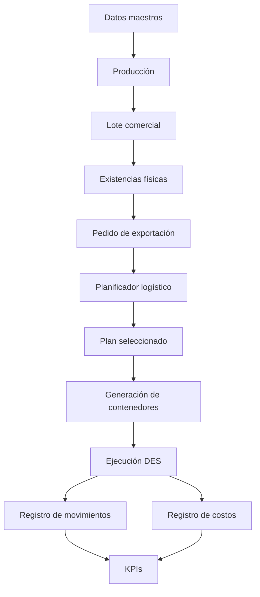
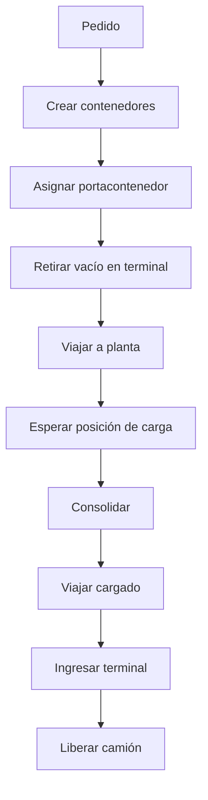
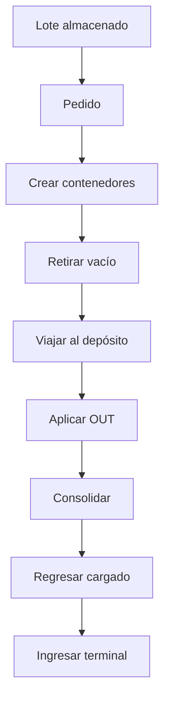
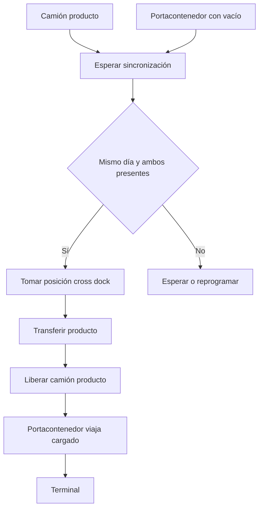

# Especificación Técnica Maestra

## Modelo AnyLogic de logística de exportación de subproductos cítricos

**Repositorio:** `mazzuccoda/Anylogic_log_arg_2026`  
**Estado del documento:** Documento vivo y editable  
**Versión inicial:** 0.1.0  
**Fecha:** 2026-07-24  
**Herramienta objetivo:** AnyLogic 8.9.9 PLE  
**Idioma:** Español  

---

# 1. Propósito del documento

Este documento define la arquitectura técnica, el modelo conceptual, las reglas de negocio, los agentes, variables, funciones, costos, flujos de simulación, decisiones de diseño, restricciones de la edición PLE, estado de avance y roadmap del proyecto.

Debe funcionar como fuente de verdad del desarrollo. Toda modificación relevante del modelo debe quedar reflejada aquí antes o inmediatamente después de su implementación.

El documento distingue tres estados:

- **Implementado:** existe actualmente en el modelo y fue probado.
- **En transición:** existe parcialmente o convive con una lógica anterior.
- **Objetivo:** diseño acordado todavía no implementado por completo.

---

# 2. Objetivo del proyecto

Construir un modelo profesional de simulación logística para representar la producción, almacenamiento, planificación, consolidación, cross docking, transporte y entrega portuaria de productos de exportación derivados del limón.

Productos modelados:

- Jugo.
- Cáscara.
- Aceite.

Todo el alcance comercial se considera exportación. No se incluyen ventas locales en la versión actual.

El modelo debe permitir responder, entre otras, las siguientes preguntas:

- ¿Dónde se encuentra cada lote y qué cantidad hay en cada ubicación?
- ¿Cuánto producto fue producido, reservado, transferido, consolidado y despachado?
- ¿Cuántos contenedores requiere cada pedido?
- ¿Qué alternativa logística es factible?
- ¿Cuál es el costo incremental de cada alternativa?
- ¿Cuál es el costo end-to-end de un pedido?
- ¿Qué costos ya fueron incurridos y deben considerarse costos históricos?
- ¿Qué recursos provocan espera o congestión?
- ¿Qué sucede si falta capacidad de depósito, camiones, contenedores o posiciones de consolidación?
- ¿Qué estrategia cumple la fecha límite con menor costo?

---

# 3. Alcance funcional

## 3.1 Incluido

- Producción diaria de jugo, cáscara y aceite.
- Capacidad de almacenamiento en planta.
- Creación y trazabilidad de lotes.
- Transferencia de producto desde planta a depósitos.
- Restricciones de depósitos por producto.
- Costos de IN, almacenamiento diario y OUT.
- Pedidos de exportación.
- Reserva de producto.
- Contenedores independientes.
- Consolidación en planta, depósito o terminal.
- Cross docking en depósito o terminal.
- Camión de producto.
- Camión portacontenedor.
- Retiro de contenedor vacío y devolución cargada con el mismo camión.
- Ingreso del contenedor a terminal.
- Costos locales, THC, terminal y despachante.
- Evaluación de alternativas logísticas.
- Indicadores de costo, inventario, servicio y utilización.

## 3.2 Fuera de alcance actual

- Ventas locales.
- Transferencias depósito a depósito.
- Optimización matemática MILP completa.
- Disponibilidad real de slots navieros.
- Aduana detallada y documentación documental.
- Demurrage y detention implementados en detalle.
- Tarifas dinámicas importadas desde sistemas externos.
- Integración con ERP, TMS o WMS.
- Múltiples calidades y clientes simultáneos completamente implementados.

---

# 4. Reglas de negocio validadas

## 4.1 Productos y contenedores

| Producto | Tipo de contenedor |
|---|---|
| Jugo | 40 ft Reefer |
| Cáscara | 40 ft HC Dry |
| Aceite | 20 ft IMO Dry |

La capacidad inicial utilizada en pruebas es:

| Tipo | Capacidad provisional |
|---|---:|
| Reefer 40 | 25 tn |
| Dry HC 40 | 25 tn |
| IMO Dry 20 | 20 tn |

Estas capacidades deben parametrizarse y no quedar permanentemente escritas en código.

## 4.2 Pedido

El pedido incluye como mínimo:

- producto;
- lote solicitado;
- cantidad;
- terminal;
- naviera;
- incoterm;
- fecha o día límite;
- calidad;
- cliente.

El incoterm se almacena pero todavía no modifica la lógica operativa.

## 4.3 Lote comercial

El lote representa una identidad comercial y productiva, no la producción de un solo día.

Un lote:

- puede completarse durante varios días;
- puede ser mayor que un contenedor;
- puede despacharse parcialmente antes de terminar su producción;
- puede estar distribuido físicamente entre planta, depósitos y contenedores;
- conserva una sola identidad comercial aunque su stock se reparta.

Ejemplo:

```text
Lote objetivo: 500 tn
Producido: 150 tn
Despachado: 25 tn
Disponible: 125 tn
Pendiente de producir: 350 tn
```

## 4.4 Restricciones de depósitos

La compatibilidad de un depósito con un producto se simplifica mediante su capacidad:

```text
capacidadProducto > 0
```

Esto significa que el depósito puede:

- recibir;
- almacenar;
- consolidar;
- operar cross docking para ese producto.

En una evolución futura estas habilitaciones podrán separarse.

## 4.5 Planta

La planta puede consolidar los tres productos.

## 4.6 Contenedores

Cada contenedor es una entidad independiente. Un pedido genera `N` contenedores.

```text
cantidadContenedores = ceil(toneladasSolicitadas / capacidadContenedor)
```

Cada contenedor mantiene su propio estado, tiempos, costos, camión y toneladas asignadas.

## 4.7 Camión portacontenedor

El mismo camión:

1. retira el contenedor vacío en terminal;
2. viaja al lugar de consolidación;
3. espera durante la carga;
4. regresa con el contenedor cargado;
5. entrega el contenedor en terminal.

El recurso queda ocupado durante todo el ciclo.

## 4.8 Cross docking

El cross docking requiere simultáneamente:

- camión con producto;
- camión portacontenedor con contenedor vacío;
- posición de cross docking.

El orden de llegada es indiferente. El primero espera al segundo.

Ambos deben estar disponibles el mismo día operativo. No es necesario que lleguen exactamente a la misma hora.

El cross docking no genera:

- costo IN;
- almacenamiento diario;
- costo OUT.

Sí genera:

- flete del producto;
- ciclo del contenedor;
- costo de cross docking;
- terminal;
- THC;
- despachante.

## 4.9 Movimientos permitidos

Permitidos:

- Planta → depósito.
- Planta → puerto.
- Planta → cross dock.
- Depósito → puerto.
- Depósito → cross dock.

No permitido en la versión actual:

- Depósito → depósito.

## 4.10 Prioridad de estrategia

Si el lote está en un depósito habilitado, la primera alternativa es consolidar en ese mismo depósito.

No se buscará otro depósito más barato en la versión inicial.

---

# 5. Arquitectura general



Principio arquitectónico:

```text
Planificar ≠ Ejecutar ≠ Costear
```

- El planificador estima.
- El flujo DES ejecuta.
- El registro de costos contabiliza.

---

# 6. Agentes

## 6.1 Main

### Estado

Implementado y en expansión.

### Responsabilidades

- contener poblaciones;
- administrar parámetros globales;
- crear pedidos;
- crear lotes;
- seleccionar depósitos;
- transferir producto;
- reservar lotes;
- generar envíos antiguos;
- generar planes logísticos;
- crear contenedores;
- calcular costos;
- consolidar indicadores.

### Poblaciones conocidas

- `pedidos`
- `lotes`
- `camiones`
- `envios`
- `contenedoresExportacion`
- `planesLogisticos`

### Variables globales conocidas

- `siguienteIdLote`
- acumuladores de costos;
- acumuladores de toneladas transferidas;
- cantidad de transferencias;
- referencias a planta, depósitos y terminales.

### Riesgo actual

`Main` concentra demasiada lógica. La arquitectura objetivo debe trasladar responsabilidades físicas hacia los agentes correspondientes y dejar en `Main` coordinación, planificación e indicadores.

---

## 6.2 Planta

### Estado

Implementada.

### Responsabilidades actuales

- producir diariamente;
- mantener stock por producto;
- limitar ingreso por capacidad;
- registrar excedente;
- retirar stock;
- crear lotes mediante `Main`.

### Parámetros conocidos

- `produccionDiariaJugo`
- `produccionDiariaCascara`
- `produccionDiariaAceite`
- `capacidadJugo`
- `capacidadCascara`
- `capacidadAceite`
- `nivelActivacionJugo`
- `nivelActivacionCascara`
- `nivelActivacionAceite`
- `stockObjetivoJugo`
- `stockObjetivoCascara`
- `stockObjetivoAceite`

### Variables conocidas

- `stockJugo`
- `stockCascara`
- `stockAceite`
- `excedenteJugo`
- `excedenteCascara`
- `excedenteAceite`
- `produccionAcumuladaJugo`
- `produccionAcumuladaCascara`
- `produccionAcumuladaAceite`

### Funciones conocidas

- `producir()`
- `agregarStock(TipoProducto producto, double toneladas)`
- `retirarStock(TipoProducto producto, double toneladas)`

### Código actual de `producir()`

```java
// Registrar toda la producción generada
produccionAcumuladaJugo += produccionDiariaJugo;
produccionAcumuladaCascara += produccionDiariaCascara;
produccionAcumuladaAceite += produccionDiariaAceite;

// Guardar stock anterior
double stockAnteriorJugo = stockJugo;
double stockAnteriorCascara = stockCascara;
double stockAnteriorAceite = stockAceite;

// Intentar almacenar la producción
agregarStock(TipoProducto.JUGO, produccionDiariaJugo);
agregarStock(TipoProducto.CASCARA, produccionDiariaCascara);
agregarStock(TipoProducto.ACEITE, produccionDiariaAceite);

// Calcular cuánto ingresó realmente
double ingresoJugo = stockJugo - stockAnteriorJugo;
double ingresoCascara = stockCascara - stockAnteriorCascara;
double ingresoAceite = stockAceite - stockAnteriorAceite;

// Acceder al agente Main
Main modelo = (Main) getRootAgent();

// Crear lotes solamente por las toneladas almacenadas
if (ingresoJugo > 0) {
    modelo.crearLoteEnPlanta(
        TipoProducto.JUGO,
        ingresoJugo,
        this
    );
}

if (ingresoCascara > 0) {
    modelo.crearLoteEnPlanta(
        TipoProducto.CASCARA,
        ingresoCascara,
        this
    );
}

if (ingresoAceite > 0) {
    modelo.crearLoteEnPlanta(
        TipoProducto.ACEITE,
        ingresoAceite,
        this
    );
}
```

### Problema conocido

La función actual crea un lote nuevo por día y producto. Esto no representa el lote comercial acumulativo.

### Código actual de `agregarStock()`

```java
if (toneladas <= 0) {
    return;
}

switch (producto) {

    case JUGO:
        double espacioJugo = capacidadJugo - stockJugo;
        double ingresadoJugo = min(toneladas, espacioJugo);
        double sobranteJugo = toneladas - ingresadoJugo;

        stockJugo += ingresadoJugo;
        excedenteJugo += sobranteJugo;
        break;

    case CASCARA:
        double espacioCascara = capacidadCascara - stockCascara;
        double ingresadoCascara = min(toneladas, espacioCascara);
        double sobranteCascara = toneladas - ingresadoCascara;

        stockCascara += ingresadoCascara;
        excedenteCascara += sobranteCascara;
        break;

    case ACEITE:
        double espacioAceite = capacidadAceite - stockAceite;
        double ingresadoAceite = min(toneladas, espacioAceite);
        double sobranteAceite = toneladas - ingresadoAceite;

        stockAceite += ingresadoAceite;
        excedenteAceite += sobranteAceite;
        break;
}
```

---

## 6.3 Deposito

### Estado

Implementado.

### Responsabilidades

- validar compatibilidad;
- controlar capacidad;
- recibir producto;
- reservar producto;
- liberar reservas;
- aplicar costos;
- consolidar;
- operar cross docking en la arquitectura objetivo.

### Variables esperadas

- capacidad por producto;
- stock por producto;
- reservado por producto;
- costos IN;
- costo diario;
- costos OUT;
- posiciones de consolidación;
- posiciones de cross docking.

### Funciones conocidas

- `puedeRecibir(TipoProducto producto, double toneladas)`
- `recibirProducto(TipoProducto producto, double toneladas)`
- `puedeReservar(TipoProducto producto, double toneladas)`
- `reservarProducto(TipoProducto producto, double toneladas)`
- `liberarReserva(TipoProducto producto, double toneladas)`

### Regla de compatibilidad

```java
capacidadProducto(producto) > 0
```

---

## 6.4 Terminal

### Estado

Implementada parcialmente.

### Responsabilidades objetivo

- entregar contenedores vacíos;
- recibir contenedores cargados;
- administrar posiciones de cross docking;
- administrar posiciones de consolidación;
- aplicar costo terminal;
- medir colas y tiempos;
- cerrar el ciclo físico del contenedor.

Terminales definidas:

- Zárate.
- T4.

---

## 6.5 Pedido

### Estado

Implementado y ampliado.

### Variables conocidas

- `idPedido`
- `codigoPedido`
- `producto`
- `toneladasSolicitadas`
- `toneladasReservadas`
- `toneladasDespachadas`
- `toneladasEntregadas`
- `diaLlegada`
- `diaLimite`
- `diaReserva`
- `diaEntrega`
- `estado`
- `depositoAsignado`
- `loteSolicitado`
- `terminalDestino`
- `naviera`
- `incoterm`
- `estrategiaSeleccionada`
- `tipoContenedor`
- `capacidadContenedorTon`
- `cantidadContenedores`
- `contenedores`
- `planesEvaluados`
- `planSeleccionado`
- `costoFleteEstimado`
- `costoConsolidadoEstimado`
- `costoTotalEstimado`
- `costoFleteReal`
- `costoConsolidacionReal`
- `costoLogisticoReal`
- `costoEstimado`
- `costoReal`
- `cantidadEnvios`
- `enviosGenerados`
- `enviosEntregados`

### Función conocida

#### `calcularCantidadContenedores()`

```java
if (capacidadContenedorTon <= 0) {
    error(
        "Capacidad de contenedor inválida para pedido: "
        + this
    );
    return 0;
}

return (int) Math.ceil(
    toneladasSolicitadas / capacidadContenedorTon
);
```

### Evolución objetivo

Agregar explícitamente:

- cliente;
- calidad;
- lote comercial objetivo;
- fecha límite terminal;
- lista de reservas parciales;
- contenedores individuales;
- costos históricos, incrementales y end-to-end.

---

## 6.6 LoteProducto

### Estado

Implementado y en transición conceptual.

### Función actual

Representa simultáneamente identidad de lote y ubicación física. Esta mezcla debe corregirse.

### Variables actuales conocidas

- `idLote`
- `producto`
- `toneladasIniciales`
- `toneladasDisponibles`
- `toneladasReservadas`
- `diaProduccion`
- `estado`
- `ubicacionActual`
- `depositoActual`
- `diaIngresoDeposito`
- `diaReserva`
- `costoAcumulado`
- `pedidoAsignado`

### Variables agregadas para múltiples ubicaciones compatibles con PLE

- `ArrayList<Agent> ubicacionesFisicas`
- `ArrayList<Double> toneladasPorUbicacion`
- `ArrayList<Double> reservadasPorUbicacion`
- `ArrayList<Double> diasIngresoPorUbicacion`

### Funciones agregadas

#### `buscarIndiceUbicacion(Agent ubicacion)`

```java
if (ubicacion == null) {
    return -1;
}

for (int i = 0; i < ubicacionesFisicas.size(); i++) {
    if (ubicacionesFisicas.get(i) == ubicacion) {
        return i;
    }
}

return -1;
```

#### `agregarToneladasEnUbicacion(Agent ubicacion, double toneladas)`

```java
if (
    ubicacion == null
    || toneladas <= 0
) {
    return;
}

int indice = buscarIndiceUbicacion(ubicacion);

if (indice >= 0) {

    double actual = toneladasPorUbicacion.get(indice);

    toneladasPorUbicacion.set(
        indice,
        actual + toneladas
    );

} else {

    ubicacionesFisicas.add(ubicacion);
    toneladasPorUbicacion.add(toneladas);
    reservadasPorUbicacion.add(0.0);
    diasIngresoPorUbicacion.add(time());
}
```

#### `getToneladasEnUbicacion(Agent ubicacion)`

```java
int indice = buscarIndiceUbicacion(ubicacion);

if (indice < 0) {
    return 0;
}

return toneladasPorUbicacion.get(indice);
```

#### `getToneladasLibresEnUbicacion(Agent ubicacion)`

```java
int indice = buscarIndiceUbicacion(ubicacion);

if (indice < 0) {
    return 0;
}

double toneladas = toneladasPorUbicacion.get(indice);
double reservadas = reservadasPorUbicacion.get(indice);

return Math.max(
    0,
    toneladas - reservadas
);
```

#### `retirarToneladasDeUbicacion(Agent ubicacion, double toneladas)`

```java
if (
    ubicacion == null
    || toneladas <= 0
) {
    return false;
}

int indice = buscarIndiceUbicacion(ubicacion);

if (indice < 0) {
    return false;
}

double toneladasActuales = toneladasPorUbicacion.get(indice);
double toneladasReservadasActuales = reservadasPorUbicacion.get(indice);
double toneladasLibres = toneladasActuales - toneladasReservadasActuales;

if (
    toneladasLibres + 0.0001
    < toneladas
) {
    return false;
}

double nuevoSaldo = toneladasActuales - toneladas;

if (nuevoSaldo <= 0.0001) {

    ubicacionesFisicas.remove(indice);
    toneladasPorUbicacion.remove(indice);
    reservadasPorUbicacion.remove(indice);
    diasIngresoPorUbicacion.remove(indice);

} else {

    toneladasPorUbicacion.set(
        indice,
        nuevoSaldo
    );
}

return true;
```

### Arquitectura objetivo

`LoteProducto` debe representar identidad comercial:

- lote;
- cliente;
- calidad;
- producto;
- objetivo;
- producido acumulado;
- reservado total;
- despachado total;
- estado comercial.

La ubicación física debe representarse por saldos por ubicación.

### Restricción PLE

AnyLogic PLE limita la cantidad de clases de objeto activas. Por ese motivo no se creó un agente independiente `ExistenciaLote`. Se implementó una solución compatible con listas paralelas dentro de `LoteProducto`.

La migración futura a una licencia sin esa restricción deberá reemplazar estas listas por una clase dedicada.

---

## 6.7 Camion

### Estado

Implementado.

### Tipos objetivo

- `CAMION_PRODUCTO`
- `PORTACONTENEDOR`

### Variables objetivo

- tipo;
- capacidad;
- ubicación;
- disponibilidad;
- pedido asignado;
- contenedor asignado;
- costo acumulado;
- estado.

### Regla

El portacontenedor permanece ocupado desde el retiro del vacío hasta el ingreso cargado a terminal.

---

## 6.8 Envio

### Estado

Implementado, pero marcado para reemplazo.

### Problema

Es una entidad demasiado genérica y representa operaciones agregadas.

### Reemplazo objetivo

`ContenedorExportacion`.

No debe eliminarse hasta que la nueva lógica de contenedores esté probada end-to-end.

---

## 6.9 ContenedorExportacion

### Estado

Creado y probado técnicamente.

### Parámetros y variables acordadas

- `idContenedor`
- `pedido`
- `lote`
- `producto`
- `tipoContenedor`
- `cantidadAsignadaTon`
- `capacidadTon`
- `terminalDestino`
- `estado`
- `lugarConsolidacion`
- `camionPortacontenedor`
- `horaRetiroVacio`
- `horaLlegadaLugarCarga`
- `horaInicioCarga`
- `horaFinCarga`
- `horaIngresoTerminal`
- `costoEstimado`
- `costoReal`
- `diaProgramadoCrossDock`
- `esCrossDock`

### Estados acordados

- `CREADO`
- `ESPERANDO_PROGRAMACION`
- `ESPERANDO_RETIRO_VACIO`
- `EN_TRANSITO_VACIO`
- `ESPERANDO_CARGA`
- `CONSOLIDANDO`
- `EN_TRANSITO_CARGADO`
- `INGRESADO_TERMINAL`
- `EXPORTADO`
- `CANCELADO`

### Prueba realizada

Se creó un contenedor Reefer de 25 tn correctamente desde `Main`.

---

## 6.10 PlanLogistico

### Estado

Creado y probado técnicamente.

### Propósito

Representar una alternativa antes de ejecutarla.

### Variables acordadas

- `idPlan`
- `pedido`
- `estrategia`
- `origenProducto`
- `lugarConsolidacion`
- `terminal`
- `estado`
- `factible`
- `motivoNoFactible`
- `cantidadContenedores`
- `tiempoEstimado`
- costos desglosados;
- costo histórico;
- costo incremental;
- costo total end-to-end.

### Función `recalcularCostos()`

```java
costoHistorico =
      costoFleteGuarda
    + costoAlmacenajeIn
    + costoAlmacenajeDiario;

costoIncremental =
      costoAlmacenajeOut
    + costoFleteCrossDock
    + costoCicloContenedor
    + costoConsolidacion
    + costoCrossDock
    + costoTerminal
    + costoTHC
    + costoDespachante;

costoTotalEndToEnd =
    costoHistorico + costoIncremental;
```

### Función `validarPlan()`

Valida actualmente:

- pedido no nulo;
- lote solicitado;
- origen;
- lugar de consolidación;
- terminal;
- cantidad de contenedores.

Debe ampliarse con:

- capacidad;
- compatibilidad;
- disponibilidad física;
- fecha límite;
- recursos;
- mismo día para cross docking;
- tarifas faltantes.

---

# 7. Option Lists

## Existentes o acordadas

### TipoProducto

- `JUGO`
- `CASCARA`
- `ACEITE`

### TipoContenedor

- `REEFER_40`
- `DRY_HC_40`
- `IMO_DRY_20`

### EstrategiaLogistica

- `SIN_DEFINIR`
- `CONSOLIDACION_PLANTA`
- `CONSOLIDACION_DEPOSITO`
- `CROSS_DOCK_DEPOSITO`
- `CROSS_DOCK_TERMINAL`

### TipoMovimiento

- `REUBICACION_PRODUCTO`
- `TRANSPORTE_CROSS_DOCK`
- `CICLO_CONTENEDOR`

### TipoCamion

- `CAMION_PRODUCTO`
- `PORTACONTENEDOR`

### EstadoContenedor

Ver sección `ContenedorExportacion`.

### CategoriaCosto

- `FLETE_GUARDA`
- `FLETE_CROSS_DOCK`
- `FLETE_CONTENEDOR`
- `ALMACENAJE_IN`
- `ALMACENAJE_DIA`
- `ALMACENAJE_OUT`
- `CONSOLIDACION`
- `CROSS_DOCK`
- `TERMINAL`
- `THC`
- `DESPACHANTE`

### EstadoPlanLogistico

- `BORRADOR`
- `FACTIBLE`
- `NO_FACTIBLE`
- `SELECCIONADO`
- `EN_EJECUCION`
- `COMPLETADO`
- `CANCELADO`

### Naviera

Valores iniciales sugeridos:

- `SIN_DEFINIR`
- `MSC`
- `MAERSK`
- `HAPAG_LLOYD`
- `CMA_CGM`
- `ONE`
- `COSCO`

---

# 8. Funciones principales de Main

## 8.1 `obtenerTipoContenedor(TipoProducto producto)`

```java
switch (producto) {

    case JUGO:
        return TipoContenedor.REEFER_40;

    case CASCARA:
        return TipoContenedor.DRY_HC_40;

    case ACEITE:
        return TipoContenedor.IMO_DRY_20;

    default:
        error("No existe tipo de contenedor para el producto: " + producto);
        return null;
}
```

## 8.2 `obtenerCapacidadContenedorTon(TipoContenedor tipo)`

```java
switch (tipo) {

    case REEFER_40:
        return 25.0;

    case DRY_HC_40:
        return 25.0;

    case IMO_DRY_20:
        return 20.0;

    default:
        error("Capacidad no definida para: " + tipo);
        return 0;
}
```

## 8.3 `crearLoteEnPlanta(...)`

### Código actual

```java
if (toneladas <= 0) {
    return null;
}

LoteProducto lote = add_lotes();

lote.idLote = siguienteIdLote;
siguienteIdLote++;

lote.producto = producto;
lote.toneladasIniciales = toneladas;
lote.toneladasDisponibles = toneladas;
lote.diaProduccion = time();
lote.estado = EstadoLote.EN_PLANTA;
lote.ubicacionActual = origen;
lote.costoAcumulado = 0;
lote.pedidoAsignado = null;

return lote;
```

### Problema

Crea un lote nuevo por día.

### Evolución

Debe localizar un lote abierto por producto, cliente, calidad y pedido, y acumular producción sin impedir despachos parciales.

## 8.4 `transferirLoteCompleto(LoteProducto lote, Deposito destino)`

### Código actual restaurado

```java
if (lote == null || destino == null) {
    return false;
}

if (
    lote.estado != EstadoLote.EN_PLANTA
    || lote.ubicacionActual != planta
    || lote.toneladasDisponibles <= 0
) {
    return false;
}

double toneladas =
    lote.toneladasDisponibles;

if (
    !destino.puedeRecibir(
        lote.producto,
        toneladas
    )
) {
    return false;
}

boolean retirado =
    planta.retirarStock(
        lote.producto,
        toneladas
    );

if (!retirado) {
    return false;
}

boolean recibido =
    destino.recibirProducto(
        lote.producto,
        toneladas
    );

if (!recibido) {

    planta.agregarStock(
        lote.producto,
        toneladas
    );

    return false;
}

lote.estado = EstadoLote.EN_DEPOSITO;
lote.ubicacionActual = destino;
lote.depositoActual = destino;
lote.diaIngresoDeposito = time();

double costoViaje =
    calcularCostoPlantaDeposito(
        destino,
        toneladas
    );

lote.costoAcumulado += costoViaje;
costoFletePlantaDeposito += costoViaje;
toneladasTransferidasDepositos += toneladas;
cantidadTransferenciasDepositos++;

return true;
```

### Evolución

Reemplazar por transferencia parcial usando saldos por ubicación.

## 8.5 `transferirProductoADepositos(...)`

### Código actual

```java
double pendiente = toneladasObjetivo;

while (pendiente > 0.0001) {

    LoteProducto lote =
        buscarLoteMasAntiguoEnPlanta(producto);

    if (lote == null) {
        break;
    }

    double toneladasLote = lote.toneladasDisponibles;

    if (toneladasLote > pendiente) {
        break;
    }

    Deposito destino =
        seleccionarDeposito(producto, toneladasLote);

    if (destino == null) {
        break;
    }

    boolean transferido =
        transferirLoteCompleto(lote, destino);

    if (!transferido) {
        break;
    }

    pendiente -= toneladasLote;
}
```

### Evolución

Debe transferir toneladas parciales sin cambiar la identidad total del lote.

## 8.6 `revisarTransferencias()`

```java
// JUGO
if (planta.stockJugo >= planta.nivelActivacionJugo) {

    double toneladas =
        planta.stockJugo - planta.stockObjetivoJugo;

    transferirProductoADepositos(
        TipoProducto.JUGO,
        toneladas
    );
}

// CASCARA
if (planta.stockCascara >= planta.nivelActivacionCascara) {

    double toneladas =
        planta.stockCascara - planta.stockObjetivoCascara;

    transferirProductoADepositos(
        TipoProducto.CASCARA,
        toneladas
    );
}

// ACEITE
if (planta.stockAceite >= planta.nivelActivacionAceite) {

    double toneladas =
        planta.stockAceite - planta.stockObjetivoAceite;

    transferirProductoADepositos(
        TipoProducto.ACEITE,
        toneladas
    );
}
```

## 8.7 `reservarLotesParaPedido(Pedido pedido, Deposito deposito)`

### Estado

La función fue modificada temporalmente para exigir un lote único suficiente. La prueba demostró que esta lógica no es compatible con el lote diario anterior.

### Decisión

No debe consolidarse definitivamente hasta migrar el lote comercial acumulativo.

### Regla objetivo

El pedido reserva toneladas de un lote comercial. La reserva puede consumir saldo en una o varias ubicaciones físicas, pero conserva una única identidad de lote.

## 8.8 `intentarAsignarPedido(Pedido pedido)`

### Código actual conocido

```java
if (pedido == null) {
    return false;
}

if (
    pedido.estado != EstadoPedido.PENDIENTE
    && pedido.estado != EstadoPedido.ATRASADO
) {
    return false;
}

if (pedido.loteSolicitado != null) {
    return true;
}

Deposito deposito =
    seleccionarDepositoParaPedido(pedido);

if (deposito == null) {
    return false;
}

boolean reservado =
    reservarLotesParaPedido(
        pedido,
        deposito
    );

if (!reservado) {
    return false;
}

pedido.depositoAsignado = deposito;
pedido.toneladasReservadas = pedido.toneladasSolicitadas;
pedido.diaReserva = time();
pedido.estado = EstadoPedido.RESERVADO;

traceln(
    "Pedido " + pedido.codigoPedido
    + " asignado al lote "
    + pedido.loteSolicitado
    + " en depósito "
    + deposito
);

return true;
```

## 8.9 `intentarAsignarPedidos()`

```java
for (Pedido pedido : pedidos) {

    if (
        pedido.estado == EstadoPedido.PENDIENTE
        || pedido.estado == EstadoPedido.ATRASADO
    ) {
        intentarAsignarPedido(pedido);
    }
}
```

---

# 9. Costos

## 9.1 Fórmula general

```text
Costo total =
  flete de guarda
+ almacenaje IN
+ almacenaje diario
+ almacenaje OUT
+ flete de cross docking
+ ciclo del contenedor
+ consolidación
+ cross docking
+ terminal
+ THC
+ despachante
```

No todos los componentes aplican simultáneamente.

## 9.2 Flete de guarda

Movimiento:

```text
Planta → depósito
```

Unidad posible:

- USD/viaje;
- USD/tn.

Si ocurrió antes del pedido, es costo histórico.

## 9.3 Flete de producto para cross docking

Movimiento:

```text
Ubicación actual del producto → punto de cross docking
```

Es independiente del portacontenedor.

## 9.4 Ciclo del contenedor

Movimiento:

```text
Terminal → lugar de carga → terminal
```

Unidad:

- USD/contenedor.

## 9.5 Almacenamiento

### IN

- USD/tn.
- Se cobra al ingreso formal.

### Almacenamiento diario

- USD/tn/día.

### OUT

- USD/tn.
- Se cobra al egreso formal.

### Cross docking

No aplica IN, almacenamiento ni OUT.

## 9.6 Consolidación

Lugar donde se carga el contenedor:

- planta;
- depósito;
- terminal.

Unidad:

- USD/contenedor.

## 9.7 Terminal

Costo por ingreso del contenedor cargado.

Depende de:

- terminal;
- producto;
- tipo de contenedor.

Unidad:

- USD/contenedor.

## 9.8 THC

Costo local cobrado por la naviera.

Depende de:

- naviera;
- terminal;
- producto;
- tipo de contenedor.

Unidad:

- USD/contenedor.

## 9.9 Despachante

Depende del lugar donde se consolida.

Unidad:

- USD/contenedor.

## 9.10 Tres vistas de costo

### Histórico

Costos ya incurridos:

- flete de guarda;
- IN;
- almacenamiento acumulado.

### Incremental

Costos generados desde el pedido:

- OUT;
- flete cross dock;
- ciclo contenedor;
- consolidación;
- cross docking;
- terminal;
- THC;
- despachante.

### End-to-end

```text
Histórico + incremental
```

---

# 10. Tablas maestras objetivo

## TarifaFleteProducto

Campos:

- origen;
- destino;
- producto;
- tipo de movimiento;
- unidad tarifaria;
- tarifa;
- vigencia desde;
- vigencia hasta.

## TarifaCicloContenedor

- terminal;
- lugar de carga;
- producto;
- tipo de contenedor;
- USD/contenedor.

## TarifaAlmacenamiento

- depósito;
- producto;
- IN USD/tn;
- storage USD/tn/día;
- OUT USD/tn.

## TarifaServicioCarga

- lugar;
- producto;
- tipo de servicio;
- USD/contenedor.

## TarifaTerminal

- terminal;
- producto;
- tipo de contenedor;
- USD/contenedor.

## TarifaTHC

- naviera;
- terminal;
- producto;
- tipo de contenedor;
- USD/contenedor.

## TarifaDespachante

- lugar de consolidación;
- producto;
- USD/contenedor.

---

# 11. Flujos operativos

## 11.1 Consolidación en planta



## 11.2 Consolidación en depósito



## 11.3 Cross docking



---

# 12. Indicadores objetivo

## Producción

- producción diaria por producto;
- producción acumulada;
- excedente por falta de capacidad;
- cumplimiento de objetivo de lote.

## Inventario

- stock planta;
- stock por depósito;
- stock por lote;
- stock por ubicación;
- reservado;
- libre;
- días de permanencia.

## Pedidos

- pedidos pendientes;
- atrasados;
- reservados;
- en ejecución;
- completos;
- cumplimiento de fecha.

## Contenedores

- creados;
- retirados vacíos;
- esperando carga;
- cargados;
- ingresados a terminal;
- exportados;
- tiempo total de ciclo.

## Recursos

- utilización de camiones;
- utilización de consolidación;
- utilización de cross dock;
- tiempo de espera;
- colas.

## Costos

- costo por pedido;
- costo por tn;
- costo por contenedor;
- costo por producto;
- costo por estrategia;
- costo histórico;
- costo incremental;
- costo end-to-end;
- desviación estimado versus real.

---

# 13. Estado actual del proyecto

| Módulo | Estado | Avance estimado | Observación |
|---|---|---:|---|
| Producción base | Implementado | 100% | Genera stock diario |
| Capacidades planta | Implementado | 100% | Controla excedente |
| Lotes diarios | Implementado | 100% | Será reemplazado conceptualmente |
| Transferencia planta-depósito | Implementado | 100% | Actualmente mueve lote completo |
| Depósitos | Implementado | 80% | Falta costeo completo y recursos |
| Reservas antiguas | Implementado | 80% | Debe adaptarse a lote comercial |
| Pedidos | Implementado | 80% | Ampliado con terminal, naviera y contenedores |
| Envíos antiguos | Implementado | 100% | Marcado para reemplazo |
| Camiones | Implementado | 70% | Falta separar roles completamente |
| Terminal | Parcial | 50% | Falta flujo completo de contenedores |
| ContenedorExportacion | Creado | 25% | Estructura y prueba técnica |
| PlanLogistico | Creado | 30% | Costos y validación básica |
| Costeo detallado | Parcial | 25% | Falta registro auditable |
| Cross docking | Diseño validado | 10% | Falta ejecución DES |
| Lote comercial acumulativo | Diseño validado | 15% | Estructura de ubicaciones iniciada |
| Optimización | Diseño | 5% | Pendiente |
| KPIs profesionales | Parcial | 20% | Pendiente consolidación |

---

# 14. Roadmap de implementación

## Fase 0 — Congelamiento y respaldo

Estado: completado.

- mantener copia funcional;
- versionar modelo;
- documentar cambios;
- no eliminar lógica antigua sin reemplazo probado.

## Fase 1 — Normalización del dominio

Estado: en curso.

- Option Lists nuevas;
- `ContenedorExportacion`;
- `PlanLogistico`;
- ampliación de `Pedido`;
- múltiples ubicaciones por lote compatibles con PLE.

## Fase 2 — Lote comercial acumulativo

Estado: pendiente inmediato.

- agregar cliente;
- agregar calidad;
- agregar toneladas objetivo;
- crear lote abierto;
- acumular producción diaria;
- permitir despacho parcial;
- separar estado comercial de disponibilidad física.

## Fase 3 — Existencias físicas

- registrar saldo por ubicación;
- transferir parcialmente;
- reservar por ubicación;
- descontar en despacho;
- eliminar gradualmente dependencia de `ubicacionActual`.

## Fase 4 — Transferencias parciales

- reemplazar `transferirLoteCompleto`;
- transferir cantidad objetivo;
- aplicar costos de flete;
- aplicar IN;
- registrar fecha de ingreso;
- conservar saldo en planta.

## Fase 5 — Reserva profesional

- localizar lote comercial;
- verificar saldo total;
- reservar en ubicaciones físicas;
- priorizar ubicación definida;
- permitir liberación de reserva;
- asociar reserva a pedido y contenedor.

## Fase 6 — Generación real de contenedores

- calcular N;
- crear cada agente;
- asignar toneladas;
- permitir último contenedor parcial;
- controlar estados individuales.

## Fase 7 — Consolidación directa

- depósito actual;
- planta;
- recursos;
- colas;
- tiempos;
- costos reales.

## Fase 8 — Cross docking

- camión producto;
- portacontenedor;
- sincronización;
- mismo día;
- espera;
- posición cross dock;
- liberación de recursos.

## Fase 9 — Terminal

- ingreso;
- colas;
- costo terminal;
- THC;
- despachante;
- cierre de contenedor.

## Fase 10 — Registro de costos

- costos históricos;
- incrementales;
- end-to-end;
- trazabilidad por pedido, lote y contenedor.

## Fase 11 — Planificador

- generar alternativas;
- validar factibilidad;
- estimar costo y tiempo;
- seleccionar estrategia;
- criterio inicial: menor costo incremental sujeto a fecha límite.

## Fase 12 — Reemplazo de Envio

- detener generación antigua;
- ejecutar contenedores;
- comparar resultados;
- eliminar `Envio` solo después de validación.

## Fase 13 — KPIs y experimentos

- dashboard;
- sensibilidad;
- escenarios;
- congestión;
- capacidad;
- costos.

## Fase 14 — Optimización avanzada

- múltiples clientes;
- múltiples calidades;
- múltiples lotes simultáneos;
- reglas de prioridad;
- heurísticas;
- MILP externo si corresponde.

---

# 15. Estrategia de migración segura

Regla principal:

> Ningún componente actual se elimina hasta que su reemplazo esté creado, probado y comparado.

Secuencia:

1. crear estructura paralela;
2. compilar;
3. ejecutar caso base;
4. validar resultados antiguos;
5. alimentar estructura nueva;
6. comparar saldos;
7. migrar una función por vez;
8. retirar código viejo;
9. actualizar documentación.

---

# 16. Riesgos técnicos

## Límite PLE

La edición PLE limita clases y puede impedir crear agentes auxiliares.

Mitigación actual:

- listas paralelas en `LoteProducto`.

Mitigación futura:

- migrar a licencia completa;
- usar clases Java internas si la licencia lo permite;
- externalizar módulos.

## Doble contabilidad

Durante la transición pueden coexistir:

- stock antiguo;
- saldo nuevo por ubicación.

Debe evitarse sumar ambas representaciones en KPIs.

## Costos duplicados

El costo histórico no debe cargarse nuevamente como costo incremental.

## Estados inconsistentes

Un lote puede seguir en producción y tener stock despachable. El estado no debe bloquear el despacho si existe saldo disponible.

## Funciones temporales

Las funciones de prueba deben identificarse y eliminarse al cerrar cada fase.

---

# 17. Decisiones de arquitectura

## ADR-001 — Contenedor independiente

**Decisión:** cada contenedor será una entidad individual.  
**Motivo:** permite representar recursos, colas, tiempos y costos reales.  
**Estado:** aceptada.

## ADR-002 — Mismo portacontenedor

**Decisión:** el mismo camión retira vacío y devuelve cargado.  
**Estado:** aceptada.

## ADR-003 — Cross docking sincronizado

**Decisión:** requiere ambos camiones y posición, dentro del mismo día.  
**Estado:** aceptada.

## ADR-004 — Depósitos habilitados por capacidad

**Decisión:** capacidad mayor que cero implica compatibilidad.  
**Estado:** aceptada.

## ADR-005 — Sin depósito a depósito

**Decisión:** no modelar transferencias entre depósitos en la versión actual.  
**Estado:** aceptada.

## ADR-006 — Lote comercial no diario

**Decisión:** el lote se completa durante varios días y permite despachos parciales.  
**Estado:** aceptada.

## ADR-007 — Múltiples ubicaciones

**Decisión:** un lote puede estar distribuido físicamente.  
**Estado:** aceptada.

## ADR-008 — Compatibilidad PLE

**Decisión:** usar listas internas en lugar de un nuevo agente de existencia física.  
**Estado:** solución transitoria aceptada.

---

# 18. Casos de prueba mínimos

## Caso 1 — Producción con capacidad suficiente

- producir 5 días;
- verificar producción acumulada;
- verificar stock planta;
- verificar cero excedente.

## Caso 2 — Capacidad insuficiente

- producción mayor que capacidad;
- verificar excedente;
- verificar que lote solo reciba cantidad almacenada.

## Caso 3 — Lote acumulativo

- lote objetivo 500 tn;
- producir 100 tn/día;
- al día 5 debe tener 500 tn producidas.

## Caso 4 — Despacho parcial

- lote producido 150 tn;
- despachar 25 tn;
- saldo disponible 125 tn;
- lote sigue abierto.

## Caso 5 — Lote dividido físicamente

- 75 tn planta;
- 50 tn depósito;
- 25 tn contenedor;
- total físico 150 tn.

## Caso 6 — Cross docking

- camión producto llega primero;
- portacontenedor llega después;
- operación comienza al estar ambos;
- sin IN, storage ni OUT.

## Caso 7 — Plan no factible

- pedido sin lote;
- plan debe quedar `NO_FACTIBLE` con motivo explícito.

## Caso 8 — Costos

- validar costo histórico;
- validar incremental;
- validar suma end-to-end;
- evitar duplicación.

---

# 19. Backlog inmediato

1. Documentar variables completas reales de cada agente mediante capturas o exportación.
2. Crear inventario completo de funciones actuales de `Main`.
3. Definir variables de cliente y calidad.
4. Diseñar lote comercial acumulativo compatible con PLE.
5. Reescribir `crearLoteEnPlanta` sin romper la producción actual.
6. Crear transferencia parcial.
7. Adaptar reserva.
8. Generar contenedores reales.
9. Diseñar tablas tarifarias.
10. Implementar `RegistroCosto` o alternativa compatible con PLE.

---

# 20. Convenciones del proyecto

## Código

- funciones en `camelCase`;
- Option Lists en `PascalCase`;
- constantes en mayúsculas;
- unidades incluidas en nombres cuando eviten ambigüedad;
- ninguna tarifa faltante debe interpretarse como cero;
- usar tolerancia `0.0001` para toneladas.

## Documentación

Cada función debe documentar:

- objetivo;
- argumentos;
- retorno;
- variables modificadas;
- dependencias;
- código actual;
- problemas;
- evolución.

## Versionado

Formato recomendado:

```text
MAJOR.MINOR.PATCH
```

- MAJOR: cambio de arquitectura.
- MINOR: nueva capacidad.
- PATCH: corrección.

---

# 21. Próxima actualización del documento

La próxima versión debe incorporar:

- inventario real completo de funciones;
- inventario de parámetros por agente;
- capturas del modelo;
- diagrama de clases;
- diagrama de estados del lote;
- diagrama de estados del contenedor;
- código objetivo de lote acumulativo;
- matriz de costos;
- matriz de validación.

---

# 22. Conclusión

El modelo actual ya posee una base funcional de producción, inventario, transferencias, reservas, transporte y costos. La evolución acordada transforma esa base en una arquitectura profesional centrada en:

- lote comercial acumulativo;
- existencias físicas distribuidas;
- contenedores independientes;
- planificación logística;
- costos auditables;
- ejecución DES;
- migración controlada.

La prioridad inmediata no es agregar más bloques sin diseño, sino completar la migración del dominio manteniendo estable el modelo funcional existente.
